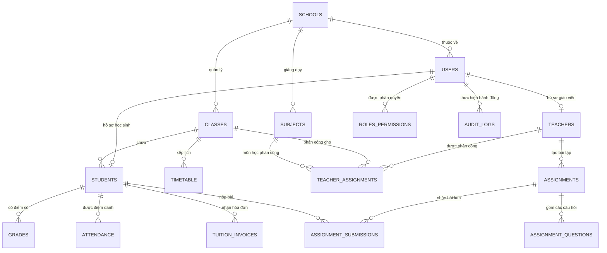
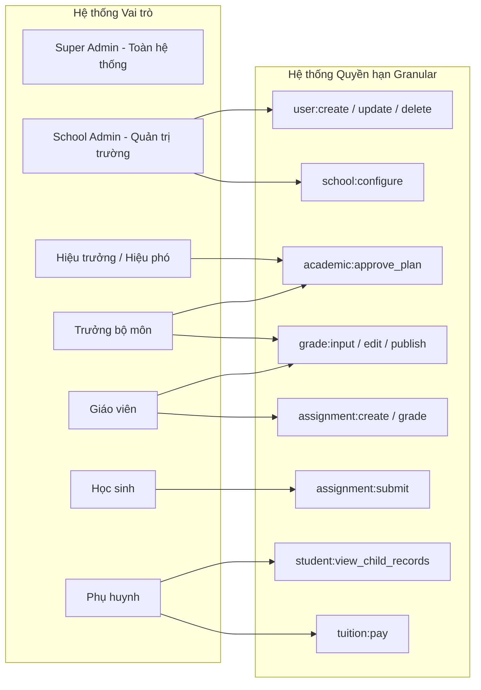

# EDUPORTAL — KIẾN TRÚC HỆ THỐNG (SYSTEM ARCHITECTURE)
**Mã tài liệu:** `docs/ARCHITECTURE.md`  
**Phiên bản:** 2.0.0 — Production Target Blueprint  
**Trạng thái:** Active Architecture Guideline  

---

## 1. TỔNG QUAN KIẾN TRÚC & MỤC TIÊU THIẾT KẾ

EduPortal là hệ thống quản lý trường học và học tập số (School Management & Digital Learning Platform) được thiết kế cho mô hình trường học phổ thông (THCS & THPT) tại Việt Nam. 

### 1.1. Triết lý kiến trúc (Architectural Principles)
1. **Modular Monolith (Nguyên khối theo module):**  
   Tuyệt đối **KHÔNG dùng Microservices**, Kafka, Kubernetes hay Redis khi chưa có yêu cầu về quy mô hàng triệu người dùng đồng thời. Toàn bộ hệ thống chạy như một ứng dụng đơn lẻ nhưng phân rã thành các domain modules biệt lập và có ranh giới rõ ràng.
2. **PostgreSQL là Single Source of Truth:**  
   Toàn bộ dữ liệu sản xuất phải nằm trên PostgreSQL (Neon Cloud Serverless). SQLite chỉ đóng vai trò database cục bộ tạm thời cho môi trường dev offline và chạy test cô lập.
3. **Phân tầng nghiêm ngặt (Strict Layering):**  
   Mỗi yêu cầu nghiệp vụ bắt buộc đi qua 4 tầng:
   $$\text{Route / Middleware} \longrightarrow \text{Controller} \longrightarrow \text{Service} \longrightarrow \text{Repository} \longrightarrow \text{Database}$$
   - **Route:** Chỉ làm nhiệm vụ map HTTP method, path và gắn middleware.
   - **Controller:** Tiếp nhận HTTP Request, validate dữ liệu đầu vào qua Schema (Zod), gọi Service và format HTTP Response chuẩn.
   - **Service:** Chứa 100% logic nghiệp vụ (tính điểm, xếp loại, kiểm tra điều kiện học bạ, logic thanh toán). Không chứa mã SQL hay câu lệnh HTTP.
   - **Repository:** Chịu trách nhiệm trực tiếp giao tiếp với Database (ORM/Query Builder/SQL). Chịu trách nhiệm enforce `school_id` / tenant scope.
4. **Không chứa Logic Nghiệp vụ trong React Components:**  
   UI components chỉ làm nhiệm vụ hiển thị và lắng nghe tương tác (Presentational & Container). Logic xử lý gọi API, format dữ liệu, quản lý trạng thái phải nằm trong custom hooks hoặc API service layer.
5. **Bảo mật Server-Side là Tuyệt đối:**  
   Không tin tưởng bất kỳ dữ liệu nào gửi lên từ client. Không dùng việc "ẩn menu trên UI" làm bảo mật. Mọi mutation và truy vấn dữ liệu nhạy cảm đều phải được kiểm tra quyền sở hữu (authorization) tại tầng backend.

---

## 2. ĐỐI CHIẾU HIỆN TRẠNG VS KIẾN TRÚC MỤC TIÊU

```mermaid
graph TD
    subgraph CURRENT_STATE [Hiện trạng Codebase (v1.0 Prototype)]
        direction TB
        C1[Client: React 18 JSX - Mock Initial State] -->|Fetch /api/*| C2[Express 5 Routes thô]
        C2 -->|SQL Trực tiếp db.prepare| C3[(SQLite Cục bộ WAL Mode)]
        C2 -.->|Chỉ dùng tại auth.js| C4[(Neon Cloud PostgreSQL)]
        C2 -->|Bypass optionalAuth| C5[Hardcoded Demo IDs]
    end

    subgraph TARGET_STATE [Kiến trúc Mục tiêu (v2.0 Modular Monolith)]
        direction TB
        T1[Client: React + TypeScript + Typed SDK] -->|REST API /api/v1/*| T2[Zod Validation & RBAC Middleware]
        T2 --> T3[Domain Controller]
        T3 --> T4[Domain Service - Pure Business Logic]
        T4 --> T5[Domain Repository - Enforces school_id]
        T5 --> T6[(PostgreSQL Neon Cloud - Production Truth)]
        T4 --> T7[Audit Trail Logger]
    end
```

### So sánh chi tiết

| Chiều kiến trúc | Hiện trạng thực tế (Current State) | Kiến trúc mục tiêu (Target State) |
|---|---|---|
| **Mô hình kiến trúc** | Monolith thô, truy vấn DB trực tiếp từ Route | **Modular Monolith phân tầng:** Controller $\rightarrow$ Service $\rightarrow$ Repository |
| **Ngôn ngữ & Typing** | JavaScript thuần (`.jsx`, `.js`), không typecheck | **100% TypeScript** cho cả Frontend và Backend |
| **Validation** | Kiểm tra chuỗi rỗng thủ công `validateInput` | **Zod Schema Validation** tại ranh giới Request Body, Query, Params |
| **API Versioning** | Chưa có versioning (`/api/student`, `/api/teacher`...) | **Chuẩn hóa versioning** `/api/v1/*` với response wrapper đồng nhất |
| **Cơ sở dữ liệu** | 95% SQLite cục bộ, 5% Neon PostgreSQL | **100% PostgreSQL (Neon)** là nguồn dữ liệu duy nhất trong production |
| **Đa trường (Multi-tenancy)** | Đơn trường (Single school), không có `school_id` | **Multi-tenant ready:** Bổ sung `school_id` vào mọi thực thể dữ liệu |
| **Phân quyền (RBAC)** | 4 role cứng, dùng `optionalAuth` làm rò rỉ dữ liệu | **RBAC + Granular Permissions:** Role-based + Permission-based server-side |
| **Giao diện Frontend** | 2 Monolith khổng lồ (1.700 dòng & 1.320 dòng), mock state | Component hóa theo Atomic/Domain, **loại bỏ 100% mock fallback** |
| **Kiểm toán (Audit)** | Gọi hàm `INSERT INTO audit_logs` thủ công rải rác | **Audit Logging Interceptor/Middleware** tự động ghi nhận mọi mutation |

---

## 3. THIẾT KẾ CƠ SỞ DỮ LIỆU & ĐA TRƯỜNG HỌC (MULTI-TENANCY)

### 3.1. Chiến lược Phân vùng Multi-Tenant (Tenant Scoping)
EduPortal áp dụng mô hình **Shared Database, Shared Schema, Tenant Discriminator Column (`school_id`)**:
- Mọi bảng liên quan đến học vụ (`classes`, `students`, `teachers`, `subjects`, `assignments`, `grades`, `attendance`, `tuition_invoices`, `school_notices`) đều bắt buộc có cột:
  ```sql
  school_id UUID NOT NULL REFERENCES schools(id) ON DELETE RESTRICT
  ```
- **Nguyên tắc bất khả xâm phạm:** Tầng Repository tự động gán điều kiện `WHERE school_id = $context.school_id` vào 100% câu truy vấn dữ liệu trường học.
- Super Admin có thể truy cập xuyên trường thông qua cơ chế impersonation có kiểm toán.

### 3.2. Sơ đồ Thực thể Quan hệ Cốt lõi (Core ERD - Target)



---

## 4. XÁC THỰC, PHÂN QUYỀN & BẢO MẬT (AUTH & SECURITY ARCHITECTURE)

### 4.1. Hệ thống Phân quyền Vai trò Đích (Target Roles & Permissions)



### 4.2. Luồng Cấp phát & Xác thực Token (Target Auth Flow)
1. **Đăng nhập (`POST /api/v1/auth/login`):**
   - Xác thực email/username/code + password qua bcrypt.
   - Trả về:
     - Access Token (JWT thời hạn ngắn: 15 phút), chứa `{ sub: userId, schoolId, role, permissions }`.
     - Refresh Token (UUID v4 ngẫu nhiên, lưu trong DB có hạn dùng 30 ngày, trả về qua `HttpOnly`, `SameSite=Strict`, `Secure` Cookie).
2. **Cơ chế Thu hồi Token (Token Revocation):**
   - Khi người dùng bấm đăng xuất hoặc đổi mật khẩu, refresh token bị vô hiệu hóa trong cơ sở dữ liệu.
3. **Loại bỏ Hoàn toàn Cửa hậu:**
   - Xóa bỏ triệt để hardcoded password (`admin@2026`). Mọi mật khẩu phải được băm an toàn qua Bcrypt (12 rounds).
4. **Bảo vệ Endpoint:**
   - Thay thế toàn bộ `optionalAuth` bằng middleware xác thực bắt buộc:
     - `authenticate`: Giải mã JWT, kiểm tra tính hợp lệ và thời hạn.
     - `requirePermission('grade:input')`: Kiểm tra quyền granular của người dùng.
     - `enforceTenantScope`: Đảm bảo người dùng chỉ truy cập tài nguyên thuộc `school_id` của họ.

---

## 5. THIẾT KẾ MODULE BACKEND (MODULAR MONOLITH)

Mỗi domain module được tổ chức khép kín:
```
server/src/modules/[module_name]/
├── [module_name].controller.ts    # Nhận Request, gọi Service, trả Response
├── [module_name].service.ts       # Xử lý 100% nghiệp vụ logic
├── [module_name].repository.ts    # Truy vấn DB, gán tenant scope
├── [module_name].validation.ts    # Zod schemas cho request payload
├── [module_name].types.ts         # TypeScript interfaces & types nội bộ
└── index.ts                       # Public API của module cho các module khác gọi
```

### Danh mục các Module Cốt lõi:
1. **Identity & Access Management (`iam`):** Quản lý users, auth, sessions, roles, permissions.
2. **Organization (`org`):** Quản lý thông tin trường học (`schools`), niên khóa, học kỳ.
3. **Academic Roster (`roster`):** Quản lý lớp học (`classes`), học sinh (`students`), giáo viên (`teachers`), phân công chuyên môn.
4. **Assessment & Grading (`assessment`):** Quản lý bài tập (`assignments`), câu hỏi (`questions`), nộp bài (`submissions`), chấm điểm và bảng điểm (`grades`).
5. **Attendance (`attendance`):** Quản lý quẹt thẻ RFID và nhật ký điểm danh học sinh.
6. **Communication (`communication`):** Thông báo toàn trường (`notices`), tin nhắn phụ huynh - giáo viên, đơn xin nghỉ phép (`leave_requests`).
7. **Finance (`finance`):** Quản lý học phí (`tuition_invoices`), thanh toán VietQR và đối soát.
8. **Digital Learning & AI (`learning`):** Kho học liệu số (`study_resources`), Trợ lý Gia sư AI Socratic.
9. **Audit & Compliance (`audit`):** Ghi vết toàn bộ hành vi thay đổi dữ liệu trên hệ thống.

---

## 6. THIẾT KẾ FRONTEND & TÍCH HỢP UI

### 6.1. Kiến trúc Tầng Frontend (Target Frontend Architecture)
```
src/
├── app/                  # Routing, Providers, App orchestrator
├── components/           # Reusable UI Primitives (Button, Badge, Card, Modal, Input)
├── layouts/              # Role-specific layouts (Admin, Teacher, Student, Parent)
├── modules/              # Feature modules theo từng vai trò
│   ├── student/          # Dashboard, Assignments, Timetable, Grades, Resources, AiTutor
│   ├── teacher/          # Dashboard, Classes, Assignments, Analytics, Reports, CreateAssignment
│   ├── parent/           # OverviewTab, GradesTab, TuitionTab, LeaveTab, MessagesTab (Đã tách nhỏ)
│   └── admin/            # OverviewTab, UsersTab, ClassesTab, FinancialsTab, AuditLogsTab (Đã tách nhỏ)
├── services/             # Typed API Client (gọi /api/v1/* qua Fetch/Axios)
└── types/                # Shared TypeScript models (User, Student, Grade, Assignment...)
```

### 6.2. Loại bỏ Mock Fallback & Chuẩn hóa UX States
Mỗi màn hình hoặc component dữ liệu bắt buộc phải xử lý đủ 5 trạng thái UX:
1. **Loading State:** Sử dụng Skeleton UI (khung xương xám chuyển động nhẹ), không dùng vòng quay spinner đơn điệu.
2. **Empty State:** Hiển thị hình minh họa tinh tế, tiêu đề thông báo rỗng và nút hành động gợi ý (Call to action).
3. **Error State:** Hiển thị thông báo lỗi thân thiện bằng tiếng Việt, kèm nút "Thử lại" (Retry).
4. **Success / Data State:** Hiển thị dữ liệu chuẩn hóa, tuân thủ `DESIGN.md`.
5. **Validation State:** Hiển thị lỗi form trực tiếp dưới từng trường nhập liệu (inline error message).

---

## 7. BẢO MẬT & QUAN SÁT VẬN HÀNH (OBSERVABILITY & COMPLIANCE)

1. **Chuẩn hóa Error Response Envelope:**
   Mọi API endpoint trả về theo định dạng JSON thống nhất:
   ```json
   {
     "success": true,
     "data": { ... },
     "meta": { "timestamp": "2026-09-20T20:00:00.000Z", "requestId": "req_12345" }
   }
   ```
   Khi có lỗi:
   ```json
   {
     "success": false,
     "error": {
       "code": "VALIDATION_FAILED",
       "message": "Thông tin nhập vào không hợp lệ",
       "details": [
         { "field": "email", "message": "Email không đúng định dạng" }
       ]
     }
   }
   ```
2. **Audit Logging:**  
   Bắt buộc ghi nhận: `timestamp`, `school_id`, `actor_id`, `actor_name`, `role`, `action`, `entity_type`, `entity_id`, `ip_address`, `changes_diff`.
3. **HTTP Security Headers:**  
   Bắt buộc áp dụng `helmet` (CSP, HSTS, X-Frame-Options, X-Content-Type-Options) và CORS whitelist domain cấu hình qua ENV.
