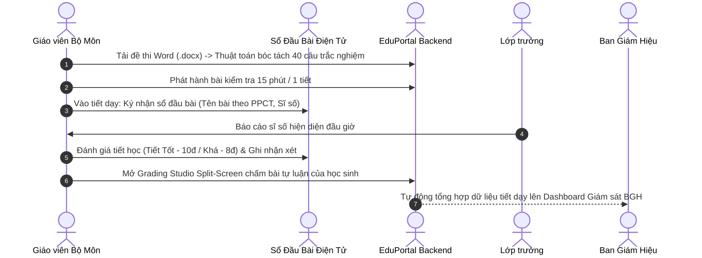
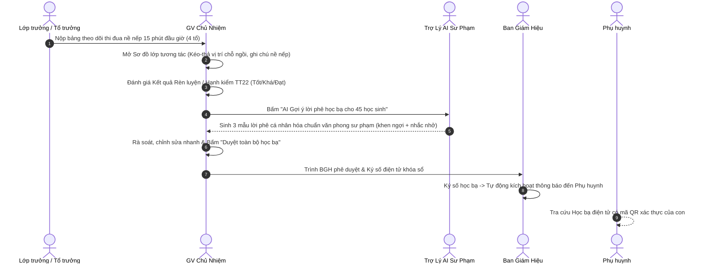
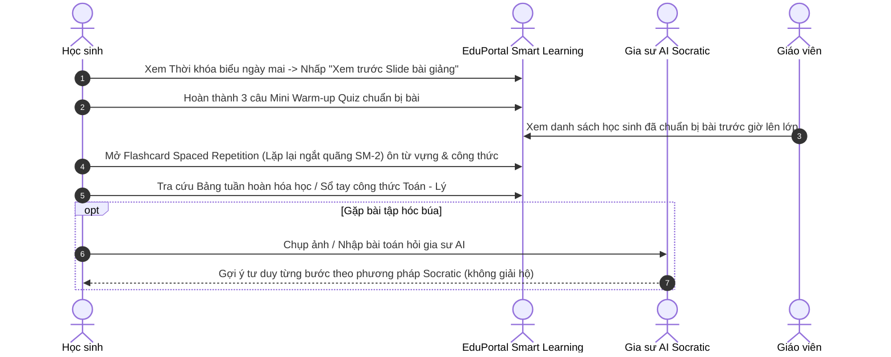
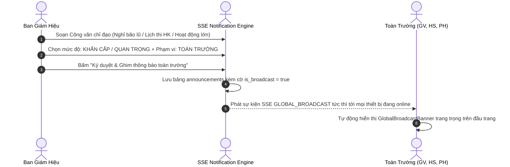

# EDUPORTAL — BẢN ĐỒ KIẾN TRÚC TOÀN DIỆN & LỘ TRÌNH PHÁT TRIỂN (MASTER ROADMAP 2026)
**Mã tài liệu:** `docs/ROADMAP.md`  
**Phiên bản:** 3.0.0 — Enterprise Full-Spectrum Edition  
**Ngày cập nhật:** 25/09/2026  
**Phạm vi:** 7 Nhóm Vai trò (Ban Giám Hiệu, Quản trị viên, Trưởng bộ môn, Giáo viên, Lớp trưởng, Học sinh, Phụ huynh)

---

## 1. TỔNG QUAN ĐÁNH GIÁ CHUYÊN SÂU DỰ ÁN (DEEP ARCHITECTURAL AUDIT)

### 1.1. Hiện trạng Kỹ thuật Cốt lõi
- **Frontend:** React 18 + Tailwind CSS + TypeScript (`.tsx`). 100% màn hình giao diện (37 màn hình) đã được chuẩn hóa TypeScript, không còn tệp `.jsx` nào trong `src/pages/` và `src/layouts/`.
- **Backend:** Express 5 + Node.js ESM. Đã phân rã thành **24 Domain Modules** độc lập tại `server/modules/` theo cấu trúc 3 tầng chuẩn: Controller $\rightarrow$ Service $\rightarrow$ Repository.
- **Cơ sở dữ liệu kép (Dual Database Engine):**
  - **Neon Cloud PostgreSQL (Primary):** Single Source of Truth cho môi trường Staging và Production.
  - **SQLite WAL mode (Offline Dev/Test):** Chạy in-memory độc lập cho bộ test runner 858+ tests (không chạm vào dữ liệu thật).
  - **35 Database Migrations** có kiểm soát phiên bản tại `server/shared/database/migrations/`.
- **Bảo mật & Phân quyền:**
  - JWT Access Token 15 phút + Refresh Token Rotation 7 ngày (SHA-256).
  - Phân quyền chi tiết (Granular RBAC) với 8 vai trò chính và 45+ dot-notation permissions.
  - Phân vùng dữ liệu đa trường học (Tenant Isolation) với trường `school_id` trên toàn bộ bảng.
- **Chất lượng Kiểm định:**
  - `npx tsc --noEmit`: **0 lỗi TypeScript**.
  - `npm test`: **858/858 tests PASS (100%)**.
  - `npm run build`: Hoàn thành trong ~4.2 giây, tách nhỏ 34 chunks (10–90KB/chunk).

---

## 2. BẢN ĐỒ 7 VAI TRÒ TRONG HỆ SINH THÁI NHÀ TRƯỜNG & PHÂN TÍCH KHOẢNG TRỐNG

```
┌─────────────────────────────────────────────────────────────────────────────────────────┐
│                           EDUPORTAL 7-ROLE ECOSYSTEM MAP                                │
├──────────────────────────┬──────────────────────────┬───────────────────────────────────┤
│ 1. BAN GIÁM HIỆU (BGH)   │ 2. QUẢN TRỊ VIÊN (ADMIN) │ 3. TRƯỞNG BỘ MÔN (DEPT HEAD)      │
│    • Điều hành chiến lược│    • Vận hành hệ thống   │    • Quản lý chuyên môn tổ        │
│    • Phê duyệt năm học   │    • Phân quyền RBAC     │    • Duyệt giáo án 5512           │
│    • Công văn chỉ đạo    │    • CSDL Ngành (EMIS)   │    • Ngân hàng đề thi bộ môn      │
├──────────────────────────┴──────────────────────────┴───────────────────────────────────┤
│ 4. ĐỘI NGŨ GIÁO VIÊN (TEACHER)                                                          │
│    ├── 4A. Giáo viên Bộ môn (GVBM): Sổ đầu bài, Báo giảng, Chấm bài Split-screen, Lab   │
│    └── 4B. Giáo viên Chủ nhiệm (GVCN): Sơ đồ lớp, Thi đua, Đánh giá hạnh kiểm, AI Lời phê│
├─────────────────────────────────────────────────────┬───────────────────────────────────┤
│ 5. LỚP TRƯỞNG & BAN CÁN SỰ (CLASS LEADERSHIP)       │ 6. PHỤ HUYNH HỌC SINH (PARENT)    │
│    • Nề nếp thi đua lớp học theo ngày (15 phút)     │    • Nắm bắt chuyên cần thời gian │
│    • Điểm danh sơ bộ đầu giờ                        │      thực qua SSE                 │
│    • Quản lý nhóm học tập "Đôi bạn cùng tiến"       │    • Học bạ điện tử QR & VietQR   │
├─────────────────────────────────────────────────────┴───────────────────────────────────┤
│ 7. HỌC SINH (STUDENT SMART LEARNING HUB)                                                │
│    • Exam Runner v2 chống gian lận & Học bạ điện tử Thông tư 22                         │
│    • Flashcard Spaced Repetition, Lớp học đảo ngược (Xem trước slide)                   │
│    • Sổ tay công thức số, Bảng tuần hoàn tương tác & Gia sư AI Socratic kèm 1-1         │
└─────────────────────────────────────────────────────────────────────────────────────────┘
```

### Bảng Phân Tích Khoảng Trống Nghiệp Vụ (Gap Analysis)

| Phân hệ / Vai trò | Hiện trạng trong Code | Khoảng trống nghiệp vụ thực tế (CẦN BỔ SUNG) |
|---|---|---|
| **Giáo viên Bộ môn (GVBM)** | Đã có: Nhập điểm TT22, điểm danh, giao bài tập cơ bản. | ❌ Sổ Đầu Bài Điện Tử: Ghi nhận tiết học (PPCT, sĩ số, nhận xét, xếp loại Tốt/Khá/TB).<br>❌ Chấm bài Split-Screen: Soi bài chụp ảnh/PDF bên trái, barem điểm bên phải.<br>❌ Bóc tách Đề thi Word (.docx): Tự nhận diện trắc nghiệm A-B-C-D trong 2s. |
| **Giáo viên Chủ nhiệm (GVCN)** | Dùng chung trang với GV bộ môn. | ❌ Command Center GVCN: Sơ đồ chỗ ngồi 4 dãy bàn kéo-thả, đánh dấu cán sự lớp.<br>❌ Đánh giá Hạnh kiểm / Rèn luyện TT22: Xếp loại Tốt/Khá/Đạt/Chưa đạt theo tháng/kỳ.<br>❌ Trợ lý AI Viết Lời Phê Học Bạ: Gợi ý 3 mẫu lời phê sư phạm cá nhân hóa cho 45 học sinh. |
| **Học sinh (Student)** | Dashboard, TKB, Điểm số, Gia sư AI chat. | ❌ Flashcard Spaced Repetition (SM-2): Ôn từ vựng Anh, công thức KaTeX, mốc Sử.<br>❌ Lớp học đảo ngược: Xem trước Slide tóm tắt trên TKB + 3 câu mini Warm-up quiz.<br>❌ Sổ tay tra cứu: Bảng tuần hoàn tương tác & Sổ tay công thức Toán - Lý. |
| **Lớp trưởng & Ban cán sự** | Bảng migration 0035 đã tạo, chưa có UI. | ❌ Sổ Theo Dõi Nề Nếp & Thi Đua 15 Phút: Ghi nhận vi phạm, chấm điểm thi đua 4 tổ. |
| **Ban Giám Hiệu (BGH)** | Dashboard báo cáo, duyệt đơn nghỉ. | ❌ Công văn BGH ghim Banner thời gian thực (`GlobalBroadcastBanner`).<br>❌ Khóa sổ điểm học kỳ & Ký số học bạ số lượng lớn. |
| **Tổ trưởng Chuyên môn** | Khung tổ bộ môn cơ bản. | ❌ Duyệt Kế hoạch Bài dạy (Giáo án CV 5512). |

---

## 3. CÁC LUỒNG NGHIỆP VỤ LIÊN THÔNG TOÀN DIỆN (SYSTEM FLOWS)

### 3.1. Luồng 1: Chu trình Sư phạm & Lên lớp của Giáo viên Bộ Môn


---

### 3.2. Luồng 2: Chu trình Công tác Chủ nhiệm & AI Lời Phê Học Bạ


---

### 3.3. Luồng 3: Chu trình Lớp Học Đảo Ngược & Góc Học Tập Thông Minh


---

### 3.4. Luồng 4: Chu trình Phát hành Công văn BGH Ghim Banner Toàn Trường


---

## 4. LỘ TRÌNH THỰC THI QUA CÁC GIAI ĐOẠN (SPRINT TIMELINE)

```
[EDUPORTAL MASTER TIMELINE 2026]
│
├── PHASE 22: LIVE OPERATIONS & REAL-TIME INTERACTION (HOÀN THÀNH - Commit 7d10c91)
│   ├── Chat 2 chiều Phụ huynh ↔ Giáo viên qua SSE (Auto Toast & Sound)
│   ├── Điểm danh bằng tay bắn thông báo SSE tức thì cho Phụ huynh
│   ├── VietQR Napas 247 Sandbox (Badge thử nghiệm & Nút gạch nợ 1.5s)
│   └── RFID Scanner mô phỏng gắn nhãn Sandbox thử nghiệm
│
├── PHASE 23: SỔ ĐẦU BÀI & CÔNG TÁC CHỦ NHIỆM (OVERNIGHT SPRINT - TASK 1)
│   ├── Sổ Đầu Bài Điện Tử từng tiết dạy (Ghi bài theo PPCT, sĩ số, nhận xét, xếp loại tiết)
│   ├── Command Center GVCN: Sơ đồ lớp kéo-thả, đánh giá hạnh kiểm TT22
│   ├── Cổng Ban Cán Sự Lớp: Giao diện Lớp trưởng theo dõi nề nếp thi đua 4 tổ 15 phút
│   └── AI Sư Phạm: Tự động sinh 3 mẫu lời phê học bạ cho 45 học sinh lớp chủ nhiệm
│
├── PHASE 24: SMART LEARNING HUB & NHẬP ĐỀ THI TỰ ĐỘNG (OVERNIGHT SPRINT - TASK 2)
│   ├── Bộ Flashcard Spaced Repetition (Thuật toán SM-2) theo môn (Anh TTS, Toán KaTeX, Sử)
│   ├── Chế độ Lớp học đảo ngược: Xem trước Slide bài giảng & 3 câu Warm-up Quiz trên TKB
│   ├── Bảng tuần hoàn hóa học tương tác & Sổ tay công thức số tra cứu nhanh
│   └── Bộ bóc tách đề thi tự động từ file Word (.docx) vào ngân hàng đề thi trong 2s
│
├── PHASE 25: GOVERNANCE, THẨM ĐỊNH CHUYÊN MÔN & ĐIỀU HÀNH BGH
│   ├── Tổ trưởng chuyên môn: Duyệt kế hoạch bài dạy (Giáo án CV 5512), Ngân hàng đề khối
│   ├── Ban Giám Hiệu: Khóa sổ điểm điện tử học kỳ, Ký số học bạ số lượng lớn
│   └── Phát thanh & Công văn BGH ghim Banner thời gian thực (GlobalBroadcastBanner)
│
└── PHASE 26: BẢO VỆ CHẤT LƯỢNG E2E, HARDENING BẢO MẬT & GO-LIVE PRODUCTION
    ├── Bộ kiểm thử Playwright E2E UI Tests tự động 4 luồng người dùng
    ├── Security Hardening: Helmet CSP, Rate-limit chống Brute-force, PII masking, /api/health
    ├── Cấu hình Docker Multi-Stage + Nginx SSL Reverse Proxy
    └── Kịch bản sao lưu CSDL tự động hàng ngày (Automated Neon Backup Cron)
```

---

## 5. MA TRẬN CHỈ SỐ DEFINITION OF DONE (DOD) TOÀN DIỆN

Mọi task phát triển trong các phase trên đều phải tuân thủ nghiêm ngặt 5 bước:
1. **Kiểm tra TypeScript:** `npx tsc --noEmit` đạt 0 lỗi (0 errors).
2. **Kiểm thử tự động:** `npm test` đạt 100% PASS (toàn bộ 858+ tests).
3. **Kiểm tra đóng gói:** `npm run build` thành công, không vỡ layout trên cả Desktop (1440px) và Mobile (375px) theo chuẩn `DESIGN.md`.
4. **Bảo mật:** Không để lộ secrets, kiểm soát quyền server-side (RBAC).
5. **Đồng bộ hóa Git:** Tự động `git add .`, `git commit` và `git push origin main`.
