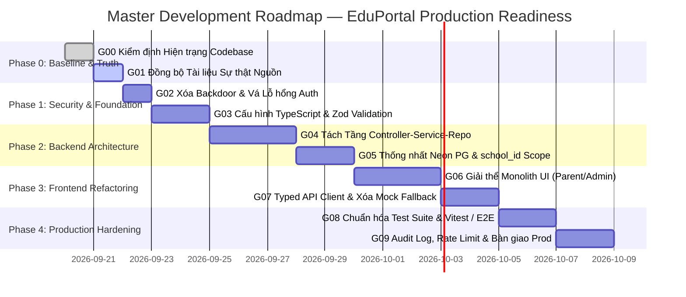

# EDUPORTAL — LỘ TRÌNH PHÁT TRIỂN & CHUYỂN ĐỔI (MASTER ROADMAP)
**Mã tài liệu:** `docs/ROADMAP.md`  
**Phiên bản:** 2.0.0 — Production Evolution Plan  
**Trạng thái:** Active Execution Plan  

---

## 1. TỔNG QUAN LỘ TRÌNH NÂNG CẤP

Lộ trình tiến hóa EduPortal từ phiên bản thử nghiệm (Prototype / Mock-hybrid) sang nền tảng quản lý trường học cấp doanh nghiệp (Production-Grade) được chia thành **5 giai đoạn tuần tự (Phases 0 - 4)**. 

Mỗi giai đoạn gồm các mục tiêu cụ thể (Goals), tuân thủ nghiêm ngặt **30 Non-Negotiable Rules**, quy trình làm việc 5 bước (**Inspect $\rightarrow$ Plan $\rightarrow$ Implement $\rightarrow$ Verify $\rightarrow$ Report**) và không làm gián đoạn các luồng nghiệp vụ đang hoạt động.

---

## 2. CHI TIẾT CÁC GIAI ĐOẠN & MỤC TIÊU (PHASES & GOALS)

### PHASE 0 — XÁC LẬP SỰ THẬT MÃ NGUỒN (ESTABLISH THE TRUTH)
*Mục tiêu: Đánh giá thực trạng mã nguồn, đối chiếu sai lệch tài liệu, không thay đổi runtime behavior.*

- [x] **G00 — Repository Baseline Audit:**
  - Khảo sát 17 chiều kiến trúc, lập tài liệu [`docs/audit/CURRENT_STATE.md`](file:///d:/Work/project_school/docs/audit/CURRENT_STATE.md).
  - Đối chiếu thực tế chạy SQLite vs tuyên bố PostgreSQL, phát hiện backdoor `admin@2026` và lỗ hổng xóa người dùng unauthenticated.
  - Kiểm tra 57/57 tests PASS không hồi quy.
- [x] **G01 — Documentation Source of Truth:**
  - Cập nhật và đồng bộ `README.md`, `AGENTS.md`.
  - Soạn thảo `docs/ARCHITECTURE.md`, `docs/ROADMAP.md`, `docs/DEVELOPMENT.md`.
  - Phân định ranh giới rõ ràng giữa **Hiện trạng Prototype** và **Mục tiêu Production**.
  - Dọn dẹp chuỗi kết nối nhạy cảm bị lộ trong `.env.example`.

---

### PHASE 1 — BẢO MẬT & NỀN TẢNG KIỂU DỮ LIỆU (SECURITY & FOUNDATION)
*Mục tiêu: Loại bỏ hoàn toàn các lỗ hổng bảo mật nghiêm trọng và thiết lập kiểm tra kiểu dữ liệu tĩnh.*

- [ ] **G02 — Loại bỏ Backdoor & Vá Triệt để Lỗ hổng Phân quyền:**
  - **Công việc:**
    - Xóa bỏ hoàn toàn backdoor `admin@2026` trong `server/routes/auth.js`.
    - Thay thế `optionalAuth` bằng middleware xác thực bắt buộc trên toàn bộ endpoint quản trị (`/api/admin/users`, `DELETE`, `PUT`, `POST`).
    - Bắt buộc kiểm tra quyền sở hữu IDOR trên các endpoint phụ huynh (`/parent/leave-requests`, `/parent/messages`).
    - Buộc server dừng (crash early) nếu thiếu `JWT_SECRET` trong môi trường production thay vì dùng secret fallback.
  - **DoD:** Không còn cách nào đăng nhập admin bằng password cứng; gọi API không có token hợp lệ phải nhận `401 Unauthorized`; 57/57 tests PASS + viết thêm negative security tests.

- [ ] **G03 — Cấu hình TypeScript & Ranh giới Validation (Zod):**
  - **Công việc:**
    - Thiết lập `tsconfig.json` cho Backend và Frontend.
    - Cài đặt Zod, xây dựng middleware `validateBody(schema)`, `validateQuery(schema)`.
    - Viết Schemas validation cho Authentication và User Management.
    - Chuẩn hóa Response Envelope `{ success: true, data: ..., meta: ... }` và mã lỗi `{ success: false, error: { code, message, details } }`.
  - **DoD:** Các request có body sai kiểu dữ liệu bị từ chối với mã lỗi 400 và thông báo tiếng Việt chi tiết; build typecheck thành công.

---

### PHASE 2 — KIẾN TRÚC BACKEND & ĐA TRƯỜNG HỌC (MODULAR BACKEND & TENANCY)
*Mục tiêu: Xóa bỏ việc viết SQL trong route, đưa PostgreSQL thành nguồn dữ liệu duy nhất và hỗ trợ multi-tenancy.*

- [ ] **G04 — Tách Tầng Controller $\rightarrow$ Service $\rightarrow$ Repository:**
  - **Công việc:**
    - Tái cấu trúc backend thành các domain modules: `iam`, `roster`, `assessment`, `attendance`, `finance`, `communication`.
    - Đưa toàn bộ raw SQL vào các Repository classes.
    - Đưa toàn bộ tính toán nghiệp vụ (tính GPA, xếp loại học lực, đánh giá nguy cơ) vào các Service classes.
    - Route chỉ gọi Controller method tương ứng.
  - **DoD:** Không còn bất kỳ câu lệnh SQL hoặc DDL `db.exec` nào nằm trong các file router; toàn bộ business logic được bao phủ bằng Unit Test.

- [ ] **G05 — Thống nhất Neon PostgreSQL & Áp dụng `school_id` Scope:**
  - **Công việc:**
    - Xây dựng hệ thống migration SQL có kiểm soát phiên bản (up/down).
    - Bổ sung bảng `schools` và cột `school_id` vào toàn bộ 18 bảng nghiệp vụ.
    - Chuyển toàn bộ runtime connection sang Neon Cloud PostgreSQL làm Single Source of Truth.
    - Cô lập SQLite chỉ chạy trong chế độ in-memory test runner offline khi không có internet.
    - Áp dụng `tenantScope` tự động trong Repository để ngăn chặn rò rỉ dữ liệu giữa các trường học.
  - **DoD:** Toàn bộ nghiệp vụ đọc/ghi được kiểm chứng trực tiếp trên Neon Cloud Database; không còn xung đột schema giữa `db.js` và `parent.js`.

---

### PHASE 3 — TÁI CẤU TRÚC GIAO DIỆN & LOẠI BỎ MOCK (FRONTEND REFACTORING)
*Mục tiêu: Đập nhỏ các UI monolith, xây dựng Typed API Client và xóa bỏ hoàn toàn mock fallback trong production flows.*

- [ ] **G06 — Phân rã Monolith `ParentDashboard` & `AdminDashboard`:**
  - **Công việc:**
    - Chia nhỏ `ParentDashboard.jsx` (1.700 dòng) thành các sub-components: `ParentOverviewTab`, `ParentGradesTab`, `ParentTuitionTab`, `ParentLeaveTab`, `ParentMessagesTab`.
    - Chia nhỏ `AdminDashboard.jsx` (1.320 dòng) thành: `AdminOverviewTab`, `AdminUsersTab`, `AdminClassesTab`, `AdminFinancialsTab`, `AdminAuditLogsTab`.
    - Giữ nguyên 100% phong cách thiết kế và tokens trong `DESIGN.md`.
  - **DoD:** Mỗi component không vượt quá 350 dòng; giao diện hiển thị đồng nhất trên cả desktop và mobile; không lỗi layout.

- [ ] **G07 — Xây dựng Typed API Client & Xử lý UX States:**
  - **Công việc:**
    - Loại bỏ việc import mock data (`src/mock/`) làm initial state trong các React components.
    - Viết lại `src/services/api.ts` kết nối trực tiếp `/api/v1/*`.
    - Triển khai đầy đủ 5 trạng thái UX: Loading Skeleton, Empty State, Error State, Success State, Validation State trên toàn bộ 16 màn hình.
  - **DoD:** Khi ngắt kết nối mạng hoặc tắt backend, UI hiển thị thông báo lỗi rõ ràng và nút thử lại, không âm thầm hiển thị dữ liệu giả định.

---

### PHASE 4 — BẢO MẬT NÂNG CAO, TESTING & PRODUCTION HANDOVER
*Mục tiêu: Tối ưu hiệu năng, hoàn thiện kiểm thử tự động, thiết lập audit logging và chuẩn bị bàn giao.*

- [ ] **G08 — Chuẩn hóa Bộ Kiểm thử Tự động (Vitest / Supertest):**
  - **Công việc:**
    - Tích hợp Vitest và Supertest thay thế bộ runner tự chế tạm thời.
    - Bổ sung test suites kiểm tra phân quyền tiêu cực (Negative Authorization Tests: học sinh sửa điểm, phụ huynh xem con nhà khác, guest gọi API cấm).
    - Thêm Component Tests cho các form quan trọng (Đăng nhập, Nộp bài tập, Nộp đơn nghỉ học).
    - Cấu hình GitHub Actions CI pipeline tự động chạy lint, typecheck và tests trên mỗi PR.
  - **DoD:** Tỷ lệ bao phủ kiểm thử đạt tối thiểu 85% cho các luồng nghiệp vụ trọng yếu; CI pipeline xanh 100%.

- [ ] **G09 — Production Hardening & Security Audit:**
  - **Công việc:**
    - Cài đặt `helmet`, `express-rate-limit` (giới hạn 5 lần đăng nhập sai / phút).
    - Bật CORS whitelist nghiêm ngặt theo domain cấu hình qua ENV.
    - Triển khai Audit Logging Interceptor tự động ghi nhận mọi thao tác thêm/sửa/xóa có gắn `school_id`, `actor_id`, `ip_address` và diff payload.
    - Chuyển polling 4.5s của thông báo khẩn sang Server-Sent Events (SSE).
    - Quét lỗ hổng mã nguồn qua `npm audit` và bảo mật dependency.
  - **DoD:** Hệ thống vượt qua bài kiểm tra bảo mật OWASP Top 10 cơ bản; tài liệu hướng dẫn vận hành và bàn giao đầy đủ.

---

## 3. MA TRẬN ĐÁNH GIÁ MỨC ĐỘ RỦI RO & BIỆN PHÁP KIỂM SOÁT

| Rủi ro kỹ thuật | Mức độ | Hậu quả tiềm ẩn | Biện pháp kiểm soát & Phòng ngừa |
|---|---|---|---|
| **Mất mát dữ liệu khi chuyển DB sang Neon PG** | CAO | Mất điểm số, thông tin học sinh hiện có | Chạy script export toàn bộ dữ liệu SQLite sang JSON/SQL trước khi chạy migration; kiểm tra toàn vẹn khóa ngoại. |
| **Gãy giao diện khi phân rã 2 Monoliths lớn** | TRUNG BÌNH | Mất CSS, vỡ layout, hỏng modal | Giữ nguyên class Tailwind gốc; test visual trên cả màn hình Desktop (1440px) và Mobile (375px) theo `DESIGN.md`. |
| **Breaking API khi đổi sang `/api/v1`** | TRUNG BÌNH | Client không gọi được backend | Tạo alias router chuyển hướng tạm thời (`app.use('/api', v1Router)`) trong giai đoạn chuyển tiếp. |
| **Chậm trễ kết nối khi dùng Neon Serverless** | THẤP | Cold-start latency tăng khi thức dậy | Sử dụng connection pooling (`-pooler` endpoint của Neon); cấu hình `idleTimeoutMillis: 30000`. |
