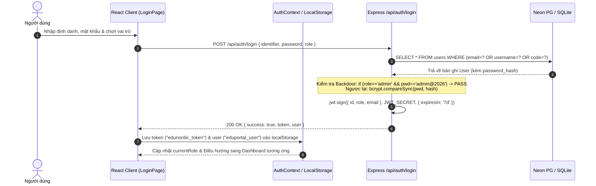
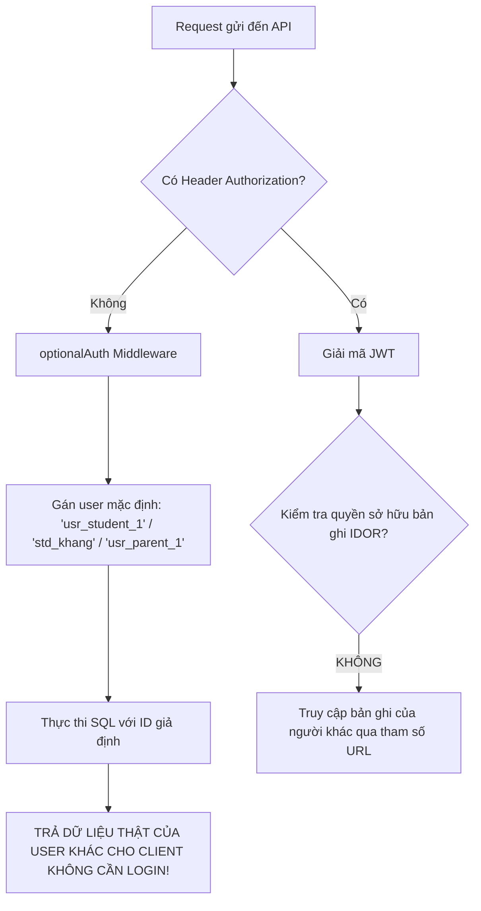
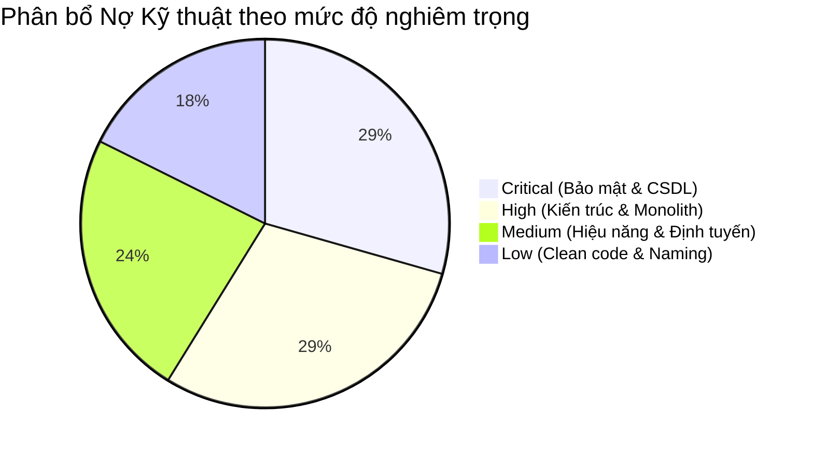
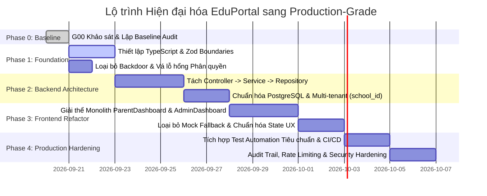

# EDUPORTAL — BÁO CÁO KIỂM ĐỊNH HIỆN TRẠNG TOÀN DIỆN (PHASE 0: BASELINE AUDIT)
**Mã tài liệu:** `docs/audit/CURRENT_STATE.md`  
**Phiên bản kiểm định:** 1.1.0 — Verified Ground-Truth Baseline  
**Vai trò thực hiện:** Principal Software Architect & Staff Full-Stack Engineer  
**Thời điểm thực hiện:** 20/09/2026  
**Mục tiêu:** Xác lập sự thật mã nguồn (Evidence-Based Baseline) đối chiếu trực tiếp với mã nguồn thực tế, các tài liệu `README.md`, `AGENTS.md` và `DESIGN.md`; làm cơ sở cho lộ trình chuyển đổi EduPortal sang hệ thống quản lý trường học cấp doanh nghiệp (Production-grade).

---

## MỤC LỤC
1. [Ngăn xếp Công nghệ Thực tế (Real Technology Stack)](#1-ngăn-xếp-công-nghệ-thực-tế-real-technology-stack)
2. [Cấu trúc Thư mục & Bố cục Dự án (Real Folder Structure)](#2-cấu-trúc-thư-mục--bố-cục-dự-án-real-folder-structure)
3. [Hiện trạng Phân quyền & Vai trò Người dùng (User Roles Audit)](#3-hiện-trạng-phân-quyền--vai-trò-người-dùng-user-roles-audit)
4. [Kiểm kê Toàn bộ Màn hình Giao diện (Frontend Screens Inventory)](#4-kiểm-kê-toàn-bộ-màn-hình-giao-diện-frontend-screens-inventory)
5. [Kiểm kê Toàn bộ Điểm cuối API (API Endpoints Inventory)](#5-kiểm-kê-toàn-bộ-điểm-cuối-api-api-endpoints-inventory)
6. [Phân tích Luồng Xác thực (Authentication Flow)](#6-phân-tích-luồng-xác-thực-authentication-flow)
7. [Lỗ hổng & Khoảng trống Phân quyền (Authorization Gaps)](#7-lỗ-hổng--khoảng-trống-phân-quyền-authorization-gaps)
8. [Mô hình Truy cập Cơ sở Dữ liệu & Xung đột Schema (Database Access & Schema Drift)](#8-mô-hình-truy-cập-cơ-sở-dữ-liệu--xung-đột-schema-database-access--schema-drift)
9. [Dữ liệu Cứng & Định danh Demo (Hardcoded Identifiers & Demo Data)](#9-dữ-liệu-cứng--định-danh-demo-hardcoded-identifiers--demo-data)
10. [Rủi ro Bảo mật & Bảng Đánh giá Nguy cơ (Security Risks Matrix)](#10-rủi-ro-bảo-mật--bảng-đánh-giá-nguy-cơ-security-risks-matrix)
11. [Các Tính năng Mô phỏng / Giả lập (Fake/Stub Functionality)](#11-các-tính-năng-mô-phỏng--giả-lập-fakestub-functionality)
12. [Thực tế Bao phủ Kiểm thử (Test Coverage Reality)](#12-thực-tế-bao-phủ-kiểm-thử-test-coverage-reality)
13. [Mâu thuẫn giữa Tài liệu & Mã nguồn Thực tế (Documentation Discrepancies)](#13-mâu-thuẫn-giữa-tài-liệu--mã-nguồn-thực-tế-documentation-discrepancies)
14. [Xếp hạng Nợ Kỹ thuật (Ranked Technical Debt: Critical / High / Medium / Low)](#14-xếp-hạng-nợ-kỹ-thuật-ranked-technical-debt)
15. [Các Module Đạt Chuẩn Giữ Lại (Modules to Retain)](#15-các-module-đạt-chuẩn-giữ-lại-modules-to-retain)
16. [Các Module Cần Tái cấu trúc (Modules Requiring Refactor)](#16-các-module-cần-tái-cấu-trúc-modules-requiring-refactor)
17. [Các Module Bắt buộc Viết lại Hoàn toàn (Modules Requiring Complete Rewrite)](#17-các-module-bắt-buộc-viết-lại-hoàn-toàn-modules-requiring-complete-rewrite)

---

## 1. Ngăn xếp Công nghệ Thực tế (Real Technology Stack)

Đối chiếu trực tiếp từ [`package.json`](file:///d:/Work/project_school/package.json) và mã nguồn:

| Lớp kiến trúc | Công nghệ thực tế | Phiên bản | Ghi chú & Đánh giá kiến trúc |
|---|---|---|---|
| **Runtime** | Node.js | v20+ | Môi trường ESM (`"type": "module"`) trên Windows x64. |
| **Frontend Framework** | React | `^18.3.1` | Sử dụng JavaScript/JSX thuần (`.jsx`), **hoàn toàn chưa có TypeScript**. |
| **Frontend Build Tool** | Vite | `^6.0.1` | Cấu hình trong [`vite.config.js`](file:///d:/Work/project_school/vite.config.js), chạy port mặc định 3000 (proxy `/api` sang port 5000). |
| **CSS & Styling** | Tailwind CSS | `^3.4.16` | Tuân thủ tốt design tokens trong [`DESIGN.md`](file:///d:/Work/project_school/DESIGN.md) qua [`tailwind.config.js`](file:///d:/Work/project_school/tailwind.config.js). |
| **Icons** | Lucide React | `^0.468.0` | Bộ outline icon nhất quán trên toàn bộ giao diện. |
| **Routing** | Không có thư viện (Tự chế) | N/A | **Không có `react-router-dom`**. Điều hướng bằng React state nội bộ (`currentView`, `activeTab`). Không đổi URL trên thanh địa chỉ. |
| **Backend Framework** | Express | `^5.2.1` | Express 5.x, viết bằng ESM JavaScript thuần. Không có kiến trúc phân tầng (Controller/Service). |
| **Cơ sở dữ liệu 1 (Chính)**| SQLite (better-sqlite3) | `^13.0.3` | **Nơi thực sự lưu trữ và xử lý 95% nghiệp vụ hệ thống** ([`server/db.js`](file:///d:/Work/project_school/server/db.js)). |
| **Cơ sở dữ liệu 2 (Dự phòng)**| PostgreSQL (pg) | `^8.23.0` | Kết nối Neon Cloud ([`server/postgres.js`](file:///d:/Work/project_school/server/postgres.js)), nhưng **chỉ được gọi duy nhất tại `/api/auth`**. |
| **Cơ sở dữ liệu 3 (Dormant)**| Supabase JS SDK | `^2.116.0` | Cấu hình trong [`server/supabase.js`](file:///d:/Work/project_school/server/supabase.js), không hoạt động nếu thiếu ENV URL/Key. |
| **Xác thực & Mã hóa** | JWT + Bcryptjs | `^9.0.3` / `^3.0.3` | Ký token HMAC-SHA256, thời hạn 7 ngày. Bcrypt 10 rounds. |
| **Kiểm thử tự động** | Test Runner tự viết | N/A | File [`tests/runner.js`](file:///d:/Work/project_school/tests/runner.js) dùng Node HTTP native. **Không có Jest / Vitest / Playwright**. |

---

## 2. Cấu trúc Thư mục & Bố cục Dự án (Real Folder Structure)

```
d:\Work\project_school\
├── server\                     # Backend Express Server
│   ├── index.js                # Server entrypoint (Mounts routes, boot seed)
│   ├── db.js                   # SQLite WAL connection, 18 tables + schema creation
│   ├── postgres.js             # Neon PostgreSQL pg.Pool adapter
│   ├── supabase.js             # Supabase client adapter (optional fallback)
│   ├── seed.js                 # Seeder dữ liệu thực tế SQLite (317 lines)
│   ├── middleware\
│   │   └── auth.js             # authenticateToken, optionalAuth, requireRole, validateInput
│   ├── routes\                 # Route handlers (chứa trực tiếp SQL queries & DDL schema)
│   │   ├── auth.js             # Đăng nhập, đổi mật khẩu, /me
│   │   ├── student.js          # Dashboard học sinh, bài tập, điểm số, thời khóa biểu
│   │   ├── teacher.js          # Dashboard giáo viên, analytics, giao bài, điểm danh
│   │   ├── parent.js           # Phụ huynh, thanh toán học phí, đơn nghỉ phép, tin nhắn (chứa cả db.exec DDL!)
│   │   ├── admin.js            # BGH, quản lý người dùng (CRUD unauthenticated!), tài chính, audit logs
│   │   ├── aiTutor.js          # Socratic AI chat (regex-based) & lưu trữ hội thoại
│   │   └── sync.js             # Đồng bộ trạng thái, thông báo toàn trường, heartbeat
│   └── supabase\               # Script khởi tạo độc lập cho Supabase (schema.sql, seed.sql)
├── src\                        # Frontend React Application
│   ├── main.jsx                # DOM Mount entrypoint
│   ├── App.jsx                 # Central State Router & Layout Orchestrator
│   ├── index.css               # Tailwind directives & font imports
│   ├── components\             # UI Primitive Components (Button, Card, Badge, Modal, Input...)
│   ├── context\
│   │   ├── AuthContext.jsx     # Quản lý phiên đăng nhập qua localStorage & API /me
│   │   └── SyncContext.jsx     # Polling đồng bộ định kỳ mỗi 4.5s
│   ├── layouts\                # Bố cục theo vai trò: Admin, Parent, Student, Teacher
│   ├── pages\
│   │   ├── auth\LoginPage.jsx  # Màn hình đăng nhập đa vai trò
│   │   ├── student\            # 7 màn hình học sinh chuyên biệt
│   │   ├── teacher\            # 6 màn hình giáo viên chuyên biệt
│   │   ├── parent\             # 1 file khổng lồ ParentDashboard.jsx (1.699 dòng)
│   │   └── admin\              # 1 file khổng lồ AdminDashboard.jsx (1.320 dòng)
│   ├── services\
│   │   └── api.js              # Client Fetch Wrapper kết nối Backend /api
│   └── mock\                   # 6 file mock data tĩnh (dùng làm initial state trong React)
├── tests\                      # Kiểm thử tự động độc lập
│   ├── runner.js               # CLI Runner thực thi toàn bộ test suites
│   ├── helpers\testClient.js   # HTTP assertions & request client
│   ├── unit\                   # auth.test.js, database.test.js
│   ├── integration\            # 6 suites tích hợp API
│   └── e2e\                    # academic_cycle.test.js
├── database.sqlite             # File SQLite runtime database
├── DESIGN.md                   # Hướng dẫn quy chuẩn giao diện Nordic Banking
├── AGENTS.md                   # Quy tắc pair-programming & phạm vi dự án
└── package.json                # Định nghĩa dependencies và scripts
```

---

## 3. Hiện trạng Phân quyền & Vai trò Người dùng (User Roles Audit)

### 3.1. Các vai trò đã được cài đặt trong CSDL
Ràng buộc dữ liệu bảng `users`:
```sql
CHECK(role IN ('student', 'teacher', 'parent', 'admin'))
```
Hệ thống hiện tại chỉ hỗ trợ **4 vai trò kỹ thuật duy nhất**.

### 3.2. Khoảng trống so với yêu cầu trong AGENTS.md
| Vai trò theo AGENTS.md | Trạng thái trong DB | Trạng thái trong UI | Khoảng trống kiến trúc (Gap) |
|---|---|---|---|
| **Admin** | Đã có (`admin`) | Có Layout riêng | Đang gộp chung Admin kỹ thuật và Hiệu trưởng. |
| **Hiệu trưởng / Hiệu phó** | **CHƯA CÓ** | Hiển thị tên danh xưng | Chưa có role `principal` / `vice_principal`. Bị ép dùng role `admin`. |
| **Trưởng bộ môn** | **CHƯA CÓ** | Hiển thị tên tổ | Chưa có role `department_head`. Không có quyền duyệt giáo án riêng. |
| **Giáo viên** | Đã có (`teacher`) | Có Layout riêng | Đáp ứng nghiệp vụ giảng dạy cơ bản. |
| **Học sinh** | Đã có (`student`) | Có Layout riêng | Đáp ứng nghiệp vụ học tập & gia sư. |
| **Phụ huynh** | Đã có (`parent`) | Có Layout riêng | Đáp ứng nghiệp vụ theo dõi con & đóng học phí. |
| **Super Admin (Multi-tenant)**| **CHƯA CÓ** | Chưa có | Hệ thống chưa có khái niệm quản trị đa trường. |

---

## 4. Kiểm kê Toàn bộ Màn hình Giao diện (Frontend Screens Inventory)

Tổng cộng: **16 màn hình / phân hệ giao diện**:

| STT | Tên màn hình | Đường dẫn Component | Trách nhiệm & Nghiệp vụ |
|---|---|---|---|
| 1 | **Đăng nhập** | [`src/pages/auth/LoginPage.jsx`](file:///d:/Work/project_school/src/pages/auth/LoginPage.jsx) | Đăng nhập theo Email/Mã định danh + Mật khẩu + Tab vai trò. |
| 2 | **Dashboard Học sinh** | [`src/pages/student/StudentDashboard.jsx`](file:///d:/Work/project_school/src/pages/student/StudentDashboard.jsx) | Banner chào mừng, bài tập cần nộp gấp, điểm số gần đây, thế mạnh/yếu. |
| 3 | **Thời khóa biểu Học sinh** | [`src/pages/student/StudentTimetablePage.jsx`](file:///d:/Work/project_school/src/pages/student/StudentTimetablePage.jsx) | Xem thời khóa biểu theo tuần (Weekly Grid) hoặc theo ngày (Day Focus). |
| 4 | **Bài tập Học sinh** | [`src/pages/student/StudentAssignmentsPage.jsx`](file:///d:/Work/project_school/src/pages/student/StudentAssignmentsPage.jsx) | Danh sách bài tập, lọc theo trạng thái, modal làm bài trắc nghiệm. |
| 5 | **Điểm danh Học sinh** | [`src/pages/student/StudentAttendancePage.jsx`](file:///d:/Work/project_school/src/pages/student/StudentAttendancePage.jsx) | Trạng thái thẻ RFID, tỷ lệ chuyên cần, nhật ký vào lớp theo tháng. |
| 6 | **Kho học liệu Học sinh** | [`src/pages/student/StudentResourcesPage.jsx`](file:///d:/Work/project_school/src/pages/student/StudentResourcesPage.jsx) | Kho tài liệu PDF, video bài giảng, đề thi mẫu, nút tải tài liệu. |
| 7 | **Bảng điểm Học sinh** | [`src/pages/student/StudentGradesPage.jsx`](file:///d:/Work/project_school/src/pages/student/StudentGradesPage.jsx) | Bảng điểm học bạ, điểm trung bình GPA, phân loại học lực, nhận xét GV. |
| 8 | **Gia sư AI Socratic** | [`src/pages/student/AiTutorPage.jsx`](file:///d:/Work/project_school/src/pages/student/AiTutorPage.jsx) | Giao diện chat hỏi bài theo phương pháp gợi mở Socratic, gợi ý tư duy nhanh. |
| 9 | **Dashboard Giáo viên** | [`src/pages/teacher/TeacherDashboard.jsx`](file:///d:/Work/project_school/src/pages/teacher/TeacherDashboard.jsx) | Tổng quan lớp chủ nhiệm, số bài nộp trong ngày, thống kê cần chấm. |
| 10 | **Quản lý Lớp học** | [`src/pages/teacher/TeacherClassesPage.jsx`](file:///d:/Work/project_school/src/pages/teacher/TeacherClassesPage.jsx) | Danh sách học sinh lớp 10A1, quẹt thẻ điểm danh, nhập nhanh điểm số. |
| 11 | **Quản lý Bài tập (GV)**| [`src/pages/teacher/TeacherAssignmentsPage.jsx`](file:///d:/Work/project_school/src/pages/teacher/TeacherAssignmentsPage.jsx) | Theo dõi bài tập đã giao, xem bài nộp, chấm điểm và nhận xét. |
| 12 | **Phân tích Năng lực** | [`src/pages/teacher/TeacherAnalytics.jsx`](file:///d:/Work/project_school/src/pages/teacher/TeacherAnalytics.jsx) | Biểu đồ radar chuyên đề, danh sách học sinh nguy cơ tụt hạng, nút báo phụ huynh. |
| 13 | **Báo cáo Sư phạm** | [`src/pages/teacher/TeacherReportsPage.jsx`](file:///d:/Work/project_school/src/pages/teacher/TeacherReportsPage.jsx) | Thống kê học kỳ, xuất file báo cáo tổ bộ môn. |
| 14 | **Tạo bài tập mới** | [`src/pages/teacher/CreateAssignment.jsx`](file:///d:/Work/project_school/src/pages/teacher/CreateAssignment.jsx) | Form 3 bước tạo trắc nghiệm/tự luận kèm khung xem trước góc nhìn học sinh. |
| 15 | **Dashboard Phụ huynh** | [`src/pages/parent/ParentDashboard.jsx`](file:///d:/Work/project_school/src/pages/parent/ParentDashboard.jsx) | **Monolith 1.699 dòng**: Đổi con em, xem điểm, nộp đơn nghỉ phép, đóng học phí VietQR. |
| 16 | **Dashboard Admin / BGH**| [`src/pages/admin/AdminDashboard.jsx`](file:///d:/Work/project_school/src/pages/admin/AdminDashboard.jsx) | **Monolith 1.320 dòng**: Quản lý tài khoản người dùng, lớp học, tài chính, đồng bộ MOET. |

---

## 5. Kiểm kê Toàn bộ Điểm cuối API (API Endpoints Inventory)

Tổng cộng: **36 endpoints** được mount dưới tiền tố `/api/*` (chưa có versioning `/v1`):

### 5.1. Phân hệ Xác thực (`/api/auth`)
| Phương thức | Đường dẫn | Quyền truy cập | Nguồn dữ liệu thực thi |
|---|---|---|---|
| `POST` | `/api/auth/login` | Công khai | PostgreSQL (nếu có cấu hình) $\rightarrow$ SQLite fallback |
| `GET` | `/api/auth/me` | `authenticateToken` | PostgreSQL $\rightarrow$ SQLite fallback |
| `POST` | `/api/auth/change-password` | `authenticateToken` | PostgreSQL $\rightarrow$ SQLite fallback |
| `POST` | `/api/auth/register` | `requireRole('admin')` | PostgreSQL $\rightarrow$ SQLite fallback |

### 5.2. Phân hệ Học sinh (`/api/student`)
| Phương thức | Đường dẫn | Quyền truy cập | Nguồn dữ liệu thực thi |
|---|---|---|---|
| `GET` | `/api/student/dashboard` | `optionalAuth` ⚠️ | SQLite thuần (`students`, `assignments`, `grades`) |
| `GET` | `/api/student/assignments` | `optionalAuth` ⚠️ | SQLite thuần (`assignments`, `submissions`) |
| `GET` | `/api/student/assignments/:id` | `optionalAuth` ⚠️ | SQLite thuần (`assignments`, `assignment_questions`) |
| `POST` | `/api/student/assignments/:id/submit`| `optionalAuth` ⚠️ | SQLite thuần (`assignment_submissions`) |
| `GET` | `/api/student/grades` | `optionalAuth` ⚠️ | SQLite thuần (`grades`, `student_competencies`) |
| `GET` | `/api/student/resources` | `optionalAuth` ⚠️ | SQLite thuần (`study_resources`) |
| `POST` | `/api/student/resources/:id/download`| `optionalAuth` ⚠️ | SQLite thuần (`study_resources`) |
| `GET` | `/api/student/timetable` | `optionalAuth` ⚠️ | SQLite thuần (`timetable`) |
| `GET` | `/api/student/attendance`| `optionalAuth` ⚠️ | SQLite thuần (`attendance`) |

### 5.3. Phân hệ Giáo viên (`/api/teacher`)
| Phương thức | Đường dẫn | Quyền truy cập | Nguồn dữ liệu thực thi |
|---|---|---|---|
| `GET` | `/api/teacher/dashboard` | `optionalAuth` ⚠️ | **Dữ liệu JSON tĩnh (hardcoded)**, không đọc DB |
| `GET` | `/api/teacher/analytics` | Công khai ⚠️ | SQLite thuần (hardcoded lọc lớp `cls_10A1`) |
| `GET` | `/api/teacher/classes` | `optionalAuth` ⚠️ | SQLite thuần (`classes`, `students`, `attendance`) |
| `POST` | `/api/teacher/grades` | `optionalAuth` ⚠️ | SQLite thuần (`grades`) |
| `GET` | `/api/teacher/assignments` | `optionalAuth` ⚠️ | SQLite thuần (`assignments`, `assignment_submissions`) |
| `POST` | `/api/teacher/submissions/:id/grade` | `optionalAuth` ⚠️ | SQLite thuần (`assignment_submissions`) |
| `GET` | `/api/teacher/reports` | `optionalAuth` ⚠️ | SQLite thuần |
| `POST` | `/api/teacher/assignments` | `optionalAuth` ⚠️ | SQLite thuần (`assignments`, `assignment_questions`) - hardcodes `created_by = 'usr_teacher_1'` |
| `POST` | `/api/teacher/intervene-notify` | `optionalAuth` ⚠️ | SQLite thuần (`school_notices`) - hardcodes sender `'Cô Mai Lan'` |
| `POST` | `/api/teacher/attendance` | `optionalAuth` ⚠️ | SQLite thuần (`attendance`) |
| `GET` | `/api/teacher/attendance` | `optionalAuth` ⚠️ | SQLite thuần (`attendance`) |

### 5.4. Phân hệ Phụ huynh (`/api/parent`)
| Phương thức | Đường dẫn | Quyền truy cập | Nguồn dữ liệu thực thi |
|---|---|---|---|
| `GET` | `/api/parent/children` | `optionalAuth` ⚠️ | SQLite thuần (hardcoded `parent_id = 'usr_parent_1'`) |
| `GET` | `/api/parent/tuition` | `optionalAuth` ⚠️ | SQLite thuần (`tuition_invoices` - hardcoded `std_khoi`) |
| `POST` | `/api/parent/tuition/:id/pay` | `optionalAuth` ⚠️ | SQLite thuần (`tuition_invoices`) |
| `POST` | `/api/parent/notices/:id/confirm` | `optionalAuth` ⚠️ | SQLite thuần (`school_notices`) |
| `GET` | `/api/parent/leave-requests` | `optionalAuth` ⚠️ | SQLite thuần (`leave_requests`) |
| `POST` | `/api/parent/leave-requests` | `optionalAuth` ⚠️ | SQLite thuần (`leave_requests`) |
| `GET` | `/api/parent/messages` | `optionalAuth` ⚠️ | SQLite thuần (`parent_teacher_messages`) |
| `POST` | `/api/parent/messages` | `optionalAuth` ⚠️ | SQLite thuần (`parent_teacher_messages`) |
| `GET` | `/api/parent/grades-detail` | `optionalAuth` ⚠️ | SQLite thuần (`grades`) |
| `GET` | `/api/parent/invoices` | `optionalAuth` ⚠️ | SQLite thuần (`tuition_invoices`) |

### 5.5. Phân hệ Quản trị & BGH (`/api/admin`)
| Phương thức | Đường dẫn | Quyền truy cập | Nguồn dữ liệu thực thi |
|---|---|---|---|
| `GET` | `/api/admin/overview` | `optionalAuth` ⚠️ | SQLite / Supabase (Chứa các phép tính cộng số ảo) |
| `POST` | `/api/admin/broadcast` | `optionalAuth` ⚠️ | SQLite thuần (`school_notices`) |
| `POST` | `/api/admin/sync-moet` | `optionalAuth` ⚠️ | SQLite thuần (Giả lập cập nhật timestamp) |
| `GET` | `/api/admin/users` | `optionalAuth` ⚠️ | SQLite thuần (`users`) |
| `POST` | `/api/admin/users` | `optionalAuth` 🚨 | SQLite thuần (**Unauthenticated User Creation**) |
| `PUT` | `/api/admin/users/:id` | `optionalAuth` 🚨 | SQLite / PG (**Unauthenticated User Update**) |
| `DELETE`| `/api/admin/users/:id` | `optionalAuth` 🚨 | SQLite / Supabase (**Unauthenticated User Deletion!**) |
| `POST` | `/api/admin/users/:id/reset-password`| `optionalAuth` 🚨 | SQLite thuần (**Unauthenticated Password Reset**) |
| `GET` | `/api/admin/classes` | `optionalAuth` ⚠️ | SQLite thuần (`classes`) |
| `POST` | `/api/admin/classes` | `optionalAuth` ⚠️ | SQLite thuần (`classes`) |
| `GET` | `/api/admin/teachers` | `optionalAuth` ⚠️ | SQLite thuần (`users`) |
| `GET` | `/api/admin/financials` | `optionalAuth` ⚠️ | SQLite thuần (`tuition_invoices`) |
| `GET` | `/api/admin/audit-logs` | `optionalAuth` ⚠️ | SQLite thuần (`audit_logs`) |
| `GET` | `/api/admin/subjects` | `optionalAuth` ⚠️ | SQLite thuần (`subjects`) |

### 5.6. Phân hệ AI Tutor & Đồng bộ (`/api/ai-tutor`, `/api/sync`)
| Phương thức | Đường dẫn | Quyền truy cập | Nguồn dữ liệu thực thi |
|---|---|---|---|
| `GET` | `/api/ai-tutor/messages` | `optionalAuth` ⚠️ | SQLite thuần (`ai_tutor_messages` - hardcoded `std_khang`) |
| `POST` | `/api/ai-tutor/chat` | `optionalAuth` ⚠️ | SQLite thuần (Khớp chuỗi if/else, không gọi LLM) |
| `GET` | `/api/sync/status` | `optionalAuth` ⚠️ | SQLite thuần (Polling mỗi 4.5s) |
| `GET` | `/api/sync/notifications` | `optionalAuth` ⚠️ | SQLite thuần (`school_notices`) |
| `POST` | `/api/sync/notifications/:id/read` | `optionalAuth` ⚠️ | SQLite thuần (`school_notices`) |
| `POST` | `/api/sync/notifications/read-all` | `optionalAuth` ⚠️ | SQLite thuần (`school_notices`) |
| `POST` | `/api/sync/trigger` | `optionalAuth` ⚠️ | SQLite thuần |
| `GET` | `/api/health` | Công khai | Trả về `{ status: 'ok' }` |

---

## 6. Phân tích Luồng Xác thực (Authentication Flow)



### Điểm yếu cốt lõi trong luồng xác thực:
1. **Backdoor Cố định:** [`server/routes/auth.js:102-104`](file:///d:/Work/project_school/server/routes/auth.js#L102-L104) bỏ qua bcrypt và cấp JWT token Admin ngay lập tức nếu nhập `admin@2026`.
2. **Thiếu Refresh Token:** JWT cấp quyền dài hạn (7 ngày). Nếu token bị rò rỉ, không có danh sách thu hồi (blacklist / revocation mechanism).
3. **Lưu trữ không an toàn:** Token lưu trong `localStorage` thay vì `HttpOnly`, `SameSite=Strict` Cookie, dễ bị đánh cắp nếu dính XSS.
4. **Không đồng bộ Brand Key:** Token lưu tên `edunordic_token`, user lưu tên `eduportal_user`.

---

## 7. Lỗ hổng & Khoảng trống Phân quyền (Authorization Gaps)



1. **Lỗ hổng Bỏ qua Xác thực Thảm họa trên Phân hệ Quản trị (`admin.js`):**  
   - [`server/routes/admin.js:325`](file:///d:/Work/project_school/server/routes/admin.js#L325): Endpoint `DELETE /api/admin/users/:id` sử dụng `optionalAuth` thay vì `requireRole('admin')`. Bất kỳ ai trên internet đều có thể gửi request DELETE và xóa sạch tài khoản giáo viên, học sinh, phụ huynh hoặc admin khác!
   - Tương tự, `POST /api/admin/users` và `PUT /api/admin/users/:id` hoàn toàn không kiểm tra quyền admin.
2. **Lỗ hổng Bỏ qua Xác thực qua `optionalAuth` ở các Router Học sinh / Giáo viên / Phụ huynh:**  
   Khi client gọi API mà không gửi token, backend **không chặn lại (401)** mà tự động gán ID của tài khoản demo, làm rò rỉ toàn bộ thông tin học bạ, điểm số của tài khoản đó.
3. **Lỗ hổng IDOR (Insecure Direct Object Reference):**  
   Endpoint `/api/parent/leave-requests?studentId=...` và `/api/parent/messages?studentId=...` cho phép client tùy ý truyền `studentId` của bất kỳ học sinh nào mà không kiểm tra xem phụ huynh hiện tại có phải là cha mẹ hợp pháp của học sinh đó hay không.
4. **Hoàn toàn thiếu Tenant Scoping (`school_id`):**  
   Không có bất kỳ trường `school_id` nào trong cơ sở dữ liệu. Bất kỳ truy vấn nào cũng trả về toàn bộ dữ liệu trong bảng mà không có sự cô lập giữa các trường học.

---

## 8. Mô hình Truy cập Cơ sở Dữ liệu & Xung đột Schema (Database Access & Schema Drift)

### 8.1. Sự phân mảnh giữa các Database Engines
Mã nguồn đang tồn tại **3 cơ chế dữ liệu song song nhưng thiếu nhất quán**:
1. **SQLite (`better-sqlite3`):**  
   Được import trực tiếp vào tất cả các route nghiệp vụ. Toàn bộ câu lệnh SQL được chuẩn bị và chạy đồng bộ (`db.prepare(...).all()`, `.get()`, `.run()`).
2. **Neon Cloud PostgreSQL (`pg.Pool`):**  
   Được cấu hình trong [`server/postgres.js`](file:///d:/Work/project_school/server/postgres.js) và kiểm tra qua biến môi trường `DATABASE_URL`. Tuy nhiên, **chỉ có duy nhất `server/routes/auth.js` là thực sự gọi `pgQuery`**, các route khác hoàn toàn bỏ qua PostgreSQL.
3. **Supabase SDK (`@supabase/supabase-js`):**  
   Chỉ được kiểm tra trong `auth.js` và `admin.js`, đóng vai trò là một tầng dự phòng chưa hoàn thiện.

### 8.2. Xung đột Schema & Thực thi DDL trong Route Handlers (Schema Pollution)
Phát hiện nghiêm trọng trong [`server/routes/parent.js:173-198`](file:///d:/Work/project_school/server/routes/parent.js#L173-L198):
- Module route tự ý gọi `db.exec(...)` để tạo mới 2 bảng `leave_requests` và `parent_teacher_messages` ngay khi file được import.
- Schema của `leave_requests` trong `parent.js` bị xung đột với `server/db.js`:
  - Trong `db.js`: `reason TEXT NOT NULL`
  - Trong `parent.js`: `reason_type TEXT NOT NULL, reason_detail TEXT NOT NULL, emergency_phone TEXT, medical_note_url TEXT`
- Trong `parent.js:201-257`, mã nguồn còn tự động chạy lệnh INSERT nạp dữ liệu mẫu (`leave_sample_1`, `msg_1`, `msg_2`, `msg_3`) ngay khi khởi động file router!

---

## 9. Dữ liệu Cứng & Định danh Demo (Hardcoded Identifiers & Demo Data)

Bảng đối chiếu các dữ liệu tĩnh đang cắm thẳng vào mã nguồn backend và frontend:

| Vị trí file | Dòng | Dữ liệu cứng | Ý nghĩa / Tác hại |
|---|---|---|---|
| [`server/routes/auth.js`](file:///d:/Work/project_school/server/routes/auth.js) | L102-104 | `admin@2026` | Cửa hậu đăng nhập mọi tài khoản admin không cần mật khẩu thật. |
| [`server/routes/student.js`](file:///d:/Work/project_school/server/routes/student.js) | L9, L17, L28 | `'usr_student_1'`, `'std_khang'` | ID học sinh cố định khi không đăng nhập. |
| [`server/routes/student.js`](file:///d:/Work/project_school/server/routes/student.js) | L36-44 | `"Còn 3 giờ 15 phút"`, `"Gấp"` | Giả lập thời gian nộp bài dựa theo chỉ số index thay vì tính toán thời gian thực. |
| [`server/routes/teacher.js`](file:///d:/Work/project_school/server/routes/teacher.js) | L8-23 | `Cô Mai Lan`, `42 học sinh` | Endpoint `/dashboard` trả về JSON tĩnh 100%, không hề chạm vào CSDL. |
| [`server/routes/teacher.js`](file:///d:/Work/project_school/server/routes/teacher.js) | L32 | `'cls_10A1'` | Hardcoded duy nhất lớp 10A1 trong truy vấn analytics. |
| [`server/routes/teacher.js`](file:///d:/Work/project_school/server/routes/teacher.js) | L137, L175, L185, L196 | `'usr_teacher_1'`, `'Cô Mai Lan'` | Tạo bài tập hay phát thông báo đều bị gán cứng vào danh tính Cô Mai Lan. |
| [`server/routes/parent.js`](file:///d:/Work/project_school/server/routes/parent.js) | L15 | `'usr_parent_1'`, `'std_khoi'` | Phụ huynh chỉ nhìn thấy duy nhất học sinh Khôi và Châu. |
| [`server/routes/parent.js`](file:///d:/Work/project_school/server/routes/parent.js) | L69-79 | Mảng `schedule`, `examAlert` tĩnh | Dữ liệu lịch học và lịch thi của con được viết tĩnh trong code backend. |
| [`server/routes/parent.js`](file:///d:/Work/project_school/server/routes/parent.js) | L338 | `'Phụ huynh Nguyễn Văn Thành'` | Tên phụ huynh trong audit log bị đổi từ Nguyễn Văn Hồi sang Nguyễn Văn Thành. |
| [`server/routes/admin.js`](file:///d:/Work/project_school/server/routes/admin.js) | L51, L56, L61 | `+ 2435`, `+ 127`, `+ 60` | Phép tính cộng số ảo để tạo cảm giác trường học có quy mô hàng ngàn học sinh. |
| [`server/routes/admin.js`](file:///d:/Work/project_school/server/routes/admin.js) | L72-88 | `gradeSubjectComparison`, `distribution` | Biểu đồ phân bổ học lực viết tĩnh thành mảng trong code. |
| [`server/routes/aiTutor.js`](file:///d:/Work/project_school/server/routes/aiTutor.js) | L9, L37 | `'std_khang'` | Toàn bộ hội thoại AI được gán cho một học sinh duy nhất. |
| [`.env.example`](file:///d:/Work/project_school/.env.example) | L6 | `postgres://neondb_owner:npg_Vp4g3cWujlQZ...` | **Lộ thông tin chuỗi kết nối Neon Cloud PostgreSQL thực tế trong Git!** |
| [`src/pages/parent/ParentDashboard.jsx`](file:///d:/Work/project_school/src/pages/parent/ParentDashboard.jsx) | L47, L60 | `PARENT_DASHBOARD_DATA`, `0912 345 678` | State khởi tạo bằng mock data, số điện thoại nộp đơn nghỉ học bị gán cứng. |
| [`src/pages/student/StudentDashboard.jsx`](file:///d:/Work/project_school/src/pages/student/StudentDashboard.jsx) | L24 | `STUDENT_DASHBOARD_DATA` | State khởi tạo bằng mock data. Nếu API lỗi, người dùng vẫn thấy dữ liệu giả. |

---

## 10. Rủi ro Bảo mật & Bảng Đánh giá Nguy cơ (Security Risks Matrix)

| Mức độ | Phân loại (CWE) | Vị trí | Mô tả chi tiết nguy cơ |
|---|---|---|---|
| **CRITICAL** | **CWE-798: Use of Hard-coded Credentials** | [`server/routes/auth.js:102`](file:///d:/Work/project_school/server/routes/auth.js#L102) | Backdoor `admin@2026` cho phép bất kỳ ai đăng nhập vào tài khoản Admin của trường. |
| **CRITICAL** | **CWE-306: Missing Authentication for Critical Function** | [`server/routes/admin.js:325`](file:///d:/Work/project_school/server/routes/admin.js#L325) | Endpoint xóa người dùng `DELETE /api/admin/users/:id` dùng `optionalAuth`, cho phép bất kỳ ai xóa tài khoản người dùng mà không cần đăng nhập. |
| **CRITICAL** | **CWE-284: Improper Access Control** | [`server/routes/student.js`](file:///d:/Work/project_school/server/routes/student.js), [`parent.js`](file:///d:/Work/project_school/server/routes/parent.js) | Dùng `optionalAuth` kèm fallback về ID cố định cho phép kẻ tấn công đọc toàn bộ thông tin học bạ mà không cần token. |
| **CRITICAL** | **CWE-538: Insertion of Sensitive Information into Externally-Accessible File** | [`.env.example:6`](file:///d:/Work/project_school/.env.example#L6) | Chuỗi kết nối trực tiếp cơ sở dữ liệu Neon Cloud PostgreSQL bị commit vào Git công khai. |
| **HIGH** | **CWE-639: IDOR (Insecure Direct Object Reference)** | [`server/routes/parent.js`](file:///d:/Work/project_school/server/routes/parent.js) | Thiếu kiểm tra quyền sở hữu quan hệ Phụ huynh - Học sinh khi truy vấn điểm số và đơn xin phép. |
| **HIGH** | **CWE-384: Session & Token Management** | [`server/middleware/auth.js:6-9`](file:///d:/Work/project_school/server/middleware/auth.js#L6-L9) | Sử dụng fallback JWT secret (`dev_fallback_secret_change_me`) khi thiếu biến môi trường thay vì dừng server. |
| **MEDIUM** | **CWE-307: Improper Restriction of Excessive Authentication Attempts** | [`server/routes/auth.js`](file:///d:/Work/project_school/server/routes/auth.js) | Không có Rate Limiting (`express-rate-limit`) trên endpoint `/api/auth/login`, nguy cơ bị Brute-force mật khẩu. |
| **MEDIUM** | **CWE-942: Overly Permissive CORS Policy** | [`server/index.js:23-27`](file:///d:/Work/project_school/server/index.js#L23-L27) | `origin: '*'` cho phép bất kỳ domain nào gửi yêu cầu kèm Header Authorization. |
| **MEDIUM** | **CWE-400: Resource Exhaustion (Denial of Service)** | [`src/context/SyncContext.jsx:44`](file:///d:/Work/project_school/src/context/SyncContext.jsx#L44) | Polling liên tục mỗi 4.5s từ mọi client gây quá tải connection pool và I/O của database. |

---

## 11. Các Tính năng Mô phỏng / Giả lập (Fake/Stub Functionality)

1. **Trợ lý Gia sư AI Socratic:**  
   Không kết nối tới bất kỳ LLM nào (OpenAI/Anthropic/Gemini). Xử lý hoàn toàn bằng biểu thức điều kiện `if (lower.includes('tam thức') || lower.includes('delta'))` trong [`server/routes/aiTutor.js:53-65`](file:///d:/Work/project_school/server/routes/aiTutor.js#L53-L65) để trả về câu trả lời định sẵn.
2. **Cổng Thanh toán Học phí VietQR Napas:**  
   Không có Webhook từ ngân hàng hoặc cổng trung gian thanh toán (SeAPay/VietQR). Nút "Thanh toán ngay" chỉ cập nhật trạng thái đơn phương `status = 'paid'` trong SQLite qua [`server/routes/parent.js:155-170`](file:///d:/Work/project_school/server/routes/parent.js#L155-L170).
3. **Đồng bộ Dữ liệu Học bạ Quốc gia MOET:**  
   Không có API kết nối cơ sở dữ liệu ngành giáo dục. Backend chỉ cập nhật trường thời gian `lastMoetSync` và trả về thông báo giả lập thành công trong [`server/routes/admin.js`](file:///d:/Work/project_school/server/routes/admin.js).
4. **Tính năng Quẹt thẻ Học sinh RFID & Tải học liệu:**  
   Không có hardware listener hay file storage thực tế (S3/Cloudinary/Local disk). Chỉ là các bản ghi database với đường link giả lập.

---

## 12. Thực tế Bao phủ Kiểm thử (Test Coverage Reality)

- **Bộ kiểm thử hiện tại:** 57/57 tests PASS trong [`tests/runner.js`](file:///d:/Work/project_school/tests/runner.js).
- **Hạn chế thực tế của bộ test:**
  1. Toàn bộ 57 bài test đều chạy dựa trên giả định máy chủ port 5000 đang bật và dữ liệu đã được seed bằng SQLite.
  2. Không có bài test nào kiểm tra trường hợp từ chối phân quyền (Negative tests: Phụ huynh A cố tình xem điểm của học sinh B; Học sinh cố tình sửa điểm của chính mình; Người dùng không đăng nhập gọi DELETE `/api/admin/users`).
  3. Hoàn toàn chưa có Unit Test cho Frontend (React components, hooks, form validations).
  4. Không sử dụng test framework tiêu chuẩn công nghiệp (Jest, Vitest), dẫn đến khó khăn trong việc tích hợp CI/CD tự động.

---

## 13. Mâu thuẫn giữa Tài liệu & Mã nguồn Thực tế (Documentation Discrepancies)

| Mục tuyên bố trong README / AGENTS.md | Hiện trạng thực tế trong Codebase | Mức độ nghiêm trọng |
|---|---|---|
| **Cơ sở dữ liệu chính là Neon Cloud PostgreSQL** | Thực tế nghiệp vụ chạy 100% trên file cục bộ `database.sqlite`. PostgreSQL chỉ được gọi duy nhất tại `/api/auth`. | **RẤT CAO (Hiểu lầm kiến trúc cốt lõi)** |
| **Phân quyền đầy đủ cho Hiệu trưởng, Trưởng bộ môn** | Trong CSDL chỉ có 4 role cứng `student`, `teacher`, `parent`, `admin`. Hiệu trưởng và Trưởng bộ môn chưa có bảng phân quyền. | **CAO** |
| **Không fallback mock trong API client** | Các component React chính (`StudentDashboard`, `ParentDashboard`, `AdminDashboard`) đều import trực tiếp mock data làm state khởi tạo. | **CAO** |
| **Brand Name chuẩn** | Trong code lẫn lộn giữa `EduPortal` và `EduNordic` (`edunordic_token`, `Trường THPT Chuyên Bắc Âu`). | **TRUNG BÌNH** |

---

## 14. Xếp hạng Nợ Kỹ thuật (Ranked Technical Debt)



### 14.1. Mức độ CRITICAL (Bắt buộc xử lý ngay ở các phase đầu)
1. **Loại bỏ Backdoor `admin@2026`** trong [`server/routes/auth.js`](file:///d:/Work/project_school/server/routes/auth.js).
2. **Vá lỗ hổng bảo mật nghiêm trọng trên Admin API:** Bắt buộc `requireRole('admin')` cho `DELETE /api/admin/users/:id`, `POST /api/admin/users`, `PUT /api/admin/users/:id`.
3. **Xóa bỏ `optionalAuth` và cơ chế demo fallback** trong các route nghiệp vụ; bắt buộc 100% endpoint được bảo vệ phải có token hợp lệ.
4. **Xóa credentials thật khỏi [`.env.example`](file:///d:/Work/project_school/.env.example)** và thay bằng placeholder an toàn.
5. **Thống nhất PostgreSQL (Neon) làm nguồn dữ liệu duy nhất (Single Source of Truth)**; giải quyết xung đột schema giữa `db.js` và `parent.js`; bổ sung `school_id` vào mọi thực thể.

### 14.2. Mức độ HIGH
1. **Tách tầng Backend:** Chuyển đổi toàn bộ route thô sang mô hình phân lớp rõ ràng: `Controller` $\rightarrow$ `Service` $\rightarrow$ `Repository`. Loại bỏ DDL `db.exec` khỏi router file.
2. **Chuyển đổi sang TypeScript:** Cấu hình TS cho backend (`server`) và frontend (`src`), áp dụng Zod để validate dữ liệu đầu vào tại ranh giới hệ thống (System Boundaries).
3. **Giải thể 2 Monolith UI khổng lồ:** Chia nhỏ [`ParentDashboard.jsx`](file:///d:/Work/project_school/src/pages/parent/ParentDashboard.jsx) (1.700 dòng) và [`AdminDashboard.jsx`](file:///d:/Work/project_school/src/pages/admin/AdminDashboard.jsx) (1.300 dòng) thành các sub-components độc lập.
4. **Loại bỏ phụ thuộc Mock Data:** Xóa việc import mock data trong các component; triển khai đầy đủ các trạng thái `LoadingSkeleton`, `EmptyState`, `ErrorState`.
5. **Chuẩn hóa Versioning API:** Đưa toàn bộ endpoints về tiền tố `/api/v1/*`.

### 14.3. Mức độ MEDIUM
1. **Thay thế Polling bằng Event-driven:** Loại bỏ polling 4.5s của [`SyncContext.jsx`](file:///d:/Work/project_school/src/context/SyncContext.jsx); chuyển sang SSE (Server-Sent Events) hoặc WebSocket cho các sự kiện thông báo khẩn.
2. **Cải tiến Định tuyến Frontend:** Sử dụng giải pháp routing chuyên dụng (React Router hoặc chuẩn hóa route-based hash) để hỗ trợ URL trực tiếp và nút Back/Forward của trình duyệt.
3. **Audit Logging tự động:** Chuyển việc ghi nhật ký kiểm toán thành một middleware/interceptor tự động ghi lại mọi thao tác thêm/sửa/xóa thay vì gọi thủ công rải rác.
4. **Thêm Rate Limiting & Bảo mật Header:** Cài đặt `helmet` và `express-rate-limit`.

### 14.4. Mức độ LOW
1. **Dọn dẹp mã nguồn thừa:** Xóa các script kiểm thử legacy nằm rải rác ở thư mục gốc (`test_*.cjs`, `verify_fullstack.cjs`).
2. **Đồng bộ định danh thương hiệu:** Đổi toàn bộ key `edunordic_token` sang `eduportal_token`.
3. **Loại bỏ dead code:** Dọn dẹp các biến import không dùng (như `pgQuery` trong `admin.js`).

---

## 15. Các Module Đạt Chuẩn Giữ Lại (Modules to Retain)

1. **Hệ thống Design Tokens & CSS Styling:**  
   - [`tailwind.config.js`](file:///d:/Work/project_school/tailwind.config.js) và [`DESIGN.md`](file:///d:/Work/project_school/DESIGN.md): Bảng màu HSL chuẩn mực (Midnight Navy, Deep Ocean Blue, Pale Sky), bo góc, viền 1px hairline, typography Be Vietnam Pro rất tinh tế và đúng chuẩn Scandinavian Banking.
2. **Bộ UI Primitives dùng chung:**  
   - Các component trong [`src/components/`](file:///d:/Work/project_school/src/components/): [`Badge.jsx`](file:///d:/Work/project_school/src/components/Badge.jsx), [`Button.jsx`](file:///d:/Work/project_school/src/components/Button.jsx), [`Card.jsx`](file:///d:/Work/project_school/src/components/Card.jsx), [`Input.jsx`](file:///d:/Work/project_school/src/components/Input.jsx), [`Modal.jsx`](file:///d:/Work/project_school/src/components/Modal.jsx). Các component này đã được đóng gói tốt, bám sát Design System.
3. **Mô hình Dữ liệu Quan hệ Thực thể (Schema 3NF):**  
   - Thiết kế quan hệ 18 bảng trong [`server/db.js`](file:///d:/Work/project_school/server/db.js) (users, classes, students, subjects, assignments, grades, attendance, timetable, tuition_invoices, audit_logs...) có cấu trúc khóa ngoại và ràng buộc chặt chẽ, chỉ cần chuẩn hóa xung đột cột và bổ sung `school_id` là có thể chuyển trực tiếp lên PostgreSQL Production.

---

## 16. Các Module Cần Tái cấu trúc (Modules Requiring Refactor)

1. **[`src/App.jsx`](file:///d:/Work/project_school/src/App.jsx):**  
   Tách logic quản lý router ra khỏi AppContent; chuẩn hóa cách phân phối props và quản lý trạng thái chọn con em/chọn tab.
2. **[`src/context/AuthContext.jsx`](file:///d:/Work/project_school/src/context/AuthContext.jsx):**  
   Bổ sung cơ chế quản lý vòng đời token, xử lý refresh token và đồng bộ trạng thái logout sạch sẽ trên mọi tab.
3. **[`src/context/SyncContext.jsx`](file:///d:/Work/project_school/src/context/SyncContext.jsx):**  
   Giảm tần suất polling hoặc chuyển sang Server-Sent Events (SSE) để giảm tải cho server.
4. **[`src/services/api.js`](file:///d:/Work/project_school/src/services/api.js):**  
   Tái cấu trúc thành Typed API Client; chuyển sang gọi `/api/v1/*`; chuẩn hóa định dạng trả về `{ success, data, error, meta }`.
5. **[`server/middleware/auth.js`](file:///d:/Work/project_school/server/middleware/auth.js):**  
   Bỏ hàm `optionalAuth` không an toàn; viết lại `authenticateToken` chặt chẽ; bổ sung `enforceRole` và `enforceTenantScope`.
6. **Các trang chức năng chuyên biệt của Học sinh & Giáo viên:**  
   [`StudentDashboard.jsx`](file:///d:/Work/project_school/src/pages/student/StudentDashboard.jsx), [`TeacherAnalytics.jsx`](file:///d:/Work/project_school/src/pages/teacher/TeacherAnalytics.jsx), [`TeacherClassesPage.jsx`](file:///d:/Work/project_school/src/pages/teacher/TeacherClassesPage.jsx): Loại bỏ state khởi tạo từ mock; thêm xử lý Loading Skeleton và Error Alert.

---

## 17. Các Module Bắt buộc Viết lại Hoàn toàn (Modules Requiring Complete Rewrite)

1. **Toàn bộ tầng Route của Backend (`server/routes/*.js`):**  
   Phải loại bỏ hoàn toàn các file route chứa SQL trực tiếp và DDL rải rác. Xây dựng lại toàn bộ backend theo cấu trúc Modular Monolith:
   ```
   server/src/
     modules/
       auth/          -> auth.controller.ts, auth.service.ts, auth.repository.ts
       student/       -> student.controller.ts, student.service.ts, student.repository.ts
       teacher/       -> teacher.controller.ts, teacher.service.ts, teacher.repository.ts
       parent/        -> parent.controller.ts, parent.service.ts, parent.repository.ts
       admin/         -> admin.controller.ts, admin.service.ts, admin.repository.ts
       ai-tutor/      -> ai-tutor.controller.ts, ai-tutor.service.ts
   ```
2. **[`src/pages/parent/ParentDashboard.jsx`](file:///d:/Work/project_school/src/pages/parent/ParentDashboard.jsx) (1.699 dòng):**  
   Phải đập nhỏ và viết lại thành thư mục `src/pages/parent/`:
   - `ParentOverviewTab.jsx`: Tổng quan con cái, thẻ KPI.
   - `ParentGradesTab.jsx`: Điểm số, học bạ chi tiết.
   - `ParentTuitionTab.jsx`: Quản lý hóa đơn và modal thanh toán VietQR.
   - `ParentLeaveTab.jsx`: Lịch sử và form gửi đơn nghỉ học.
   - `ParentMessagesTab.jsx`: Hộp thư trao đổi với giáo viên chủ nhiệm.
3. **[`src/pages/admin/AdminDashboard.jsx`](file:///d:/Work/project_school/src/pages/admin/AdminDashboard.jsx) (1.320 dòng):**  
   Phải viết lại thành thư mục `src/pages/admin/`:
   - `AdminOverviewTab.jsx`: Chỉ số vĩ mô toàn trường thực tế.
   - `AdminUsersTab.jsx`: Bảng quản lý người dùng, modal thêm/sửa/reset mật khẩu.
   - `AdminClassesTab.jsx`: Quản lý danh mục lớp và phân công giảng dạy.
   - `AdminFinancialsTab.jsx`: Thống kê thu học phí toàn trường.
   - `AdminAuditLogsTab.jsx`: Bảng theo dõi nhật ký kiểm toán bảo mật.
4. **Hệ thống Database Adapter & Seed:**  
   Thống nhất chuyển toàn bộ sang PostgreSQL Migration Scripts (`migrations/001_init_schema.sql` có `school_id`); biến SQLite thành tùy chọn test offline cô lập thay vì làm runtime chính như hiện tại.

---

## BẢN ĐỒ LỘ TRÌNH CHUYỂN ĐỔI (MIGRATION ROADMAP)



---
*Tài liệu kiểm định được lập và đối chiếu nguồn trực tiếp bởi Principal Software Architect & Staff Full-Stack Engineer — Ngày hoàn tất: 20/09/2026.*
