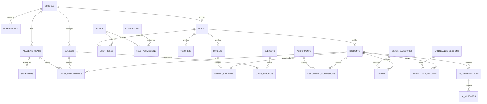

# Từ Điển Thực Thể & Kiến Trúc Dữ Liệu Chuẩn Hóa (Core Domain Schema Reference)

Tài liệu này mô tả chi tiết toàn bộ các thực thể dữ liệu nghiệp vụ chuẩn hóa của EduPortal trong cơ sở dữ liệu PostgreSQL (Neon Cloud) theo quy chuẩn kiến trúc Phase 2: Goal G06.

---

## 1. Sơ Đồ Quan Hệ Thực Thể Tổng Quan (ERD Overview)

---

## 2. Chi Tiết 12 Phân Hệ Nghiệp Vụ (Domain Areas)

### 2.1. TENANCY (Đa Trường Học)
- **`schools`**:
  - `id` (VARCHAR(64), PK): Khóa chính định danh trường (ví dụ `sch_bacau`).
  - `code` (VARCHAR(50), UNIQUE): Mã trường duy nhất toàn quốc (ví dụ `BACAU_THPT`).
  - `name` (VARCHAR(255)): Tên chính thức (ví dụ `Trường THPT Chuyên Bắc Âu`).
  - `status` (VARCHAR(32)): Trạng thái hoạt động (`active`, `inactive`, `suspended`).
  - `province`, `district`, `ward`: Địa chỉ hành chính phân cấp.
  - `principal_name`: Họ tên hiệu trưởng đại diện pháp lý.

---

### 2.2. ACADEMIC TIME (Thời Gian Học Vụ)
- **`academic_years`**:
  - `id` (VARCHAR(64), PK): `ay_2024_2025`.
  - `school_id` (FK $\rightarrow$ `schools.id`): Ràng buộc trường.
  - `name`: Tên niên khóa (ví dụ `2024 - 2025`).
  - `start_date`, `end_date`: Khoảng thời gian bắt đầu và kết thúc năm học.
  - `is_current`: Cờ đánh dấu năm học hiện tại.
- **`semesters`**:
  - `id` (VARCHAR(64), PK): `sem_2024_1`, `sem_2024_2`.
  - `academic_year_id` (FK $\rightarrow$ `academic_years.id`).
  - `semester_number` (INTEGER): `1` (Học kỳ I), `2` (Học kỳ II), `3` (Học kỳ hè).
  - `is_current`: Cờ đánh dấu học kỳ đang diễn ra.

---

### 2.3. IDENTITY & RBAC (Định Danh & Phân Quyền Vai Trò)
- **`users`**:
  - `id`, `username`, `email`, `password_hash`, `role`, `name`, `code`, `phone`, `avatar`.
  - `school_id` (FK $\rightarrow$ `schools.id`): Tenant isolation.
  - `deleted_at`: Soft delete phục vụ lưu trữ lịch sử học bạ / kiểm toán.
- **`roles`**:
  - `id`: `role_admin`, `role_principal`, `role_vice_principal`, `role_dept_head`, `role_teacher`, `role_student`, `role_parent`.
  - `name`, `display_name`, `description`, `is_system`.
- **`permissions`**:
  - `id`, `code` (ví dụ `grades:edit`, `grades:lock`, `classes:manage`), `module`, `description`.
- **`role_permissions`**:
  - Ánh xạ nhiều-nhiều giữa Role và Permission.
- **`user_roles`**:
  - Gán quyền linh hoạt đa vai trò cho người dùng (ví dụ: Một giáo viên có thể vừa là Giáo viên bộ môn vừa là Trưởng bộ môn hoặc Phó hiệu trưởng).

---

### 2.4. PEOPLE (Học Sinh, Giáo Viên, Phụ Huynh)
- **`departments`**:
  - Tổ chuyên môn: Toán - Tin, Ngữ văn, KHTN, Ngoại ngữ.
  - `head_teacher_id`: Trưởng bộ môn.
- **`teachers`**:
  - Hồ sơ sư phạm: `department_id`, `specialty`, `qualification`, `status` (`active`, `on_leave`, `resigned`).
- **`students`**:
  - Hồ sơ học sinh: `school_id`, `current_class_id`, `enrollment_date`, `status` (`active`, `graduated`, `suspended`, `transferred`).
- **`parents`**:
  - Hồ sơ phụ huynh: `occupation`, `workplace`.
- **`parent_students`**:
  - Chuẩn hóa quan hệ phụ huynh - học sinh: `relationship` (`father`, `mother`, `guardian`, `other`), `is_primary_contact`.

---

### 2.5. ACADEMIC STRUCTURE (Cấu Trúc Học Thuật)
- **`classes`**:
  - Lớp học: `school_id`, `name`, `grade_level` (10, 11, 12), `academic_year_id`, `homeroom_teacher_id`, `max_students`.
- **`subjects`**:
  - Danh mục môn học: `department_id`, `code`, `name`.
- **`class_enrollments`**:
  - Lịch sử học sinh theo học từng lớp qua các năm học (`enrolled`, `completed`, `dropped`, `transferred`).
- **`class_subjects`**:
  - Phân công giáo viên bộ môn giảng dạy môn học cụ thể cho từng lớp trong năm học.

---

### 2.6. LEARNING & ASSESSMENT (Khảo Thí & Đánh Giá)
- **`grade_categories`**:
  - Chuẩn phân loại đánh giá MOET: `MIENG` (Kiểm tra miệng), `15P` (15 phút), `1TIET` (1 tiết), `GIUA_KY` (Giữa kỳ), `CUOI_KY` (Cuối kỳ) kèm hệ số (`coefficient`).
- **`grades`**:
  - Điểm số: `grade_category_id`, `class_id`, `academic_year_id`, `semester_id`, `is_locked` (chốt sổ điểm không cho sửa).
- **`assignments`**, **`assignment_questions`**, **`assignment_submissions`**:
  - Hệ thống bài tập điện tử và trắc nghiệm trực tuyến.

---

### 2.7. ATTENDANCE (Chuyên Cần & Điểm Danh)
- **`attendance_sessions`**:
  - Phiên điểm danh theo ngày hoặc tiết học (`daily`, `period`, `exam`).
- **`attendance_records`**:
  - Bản ghi điểm danh chi tiết từng học sinh: `status` (`present`, `absent`, `late`, `excused`), `note`.

---

### 2.8. COMMUNICATION & OPERATIONS (Giao Tiếp & Học Vụ)
- **`announcements`**: Thông báo phân cấp (`school`, `class`, `grade`, `department`, `teachers`, `parents`, `students`).
- **`notifications`**: Thông báo hộp thư người dùng (`info`, `assignment`, `grade`, `attendance`, `tuition`, `urgent`).
- **`parent_teacher_messages`**: Tin nhắn trao đổi phụ huynh và giáo viên chủ nhiệm.
- **`tuition_invoices`** & **`tuition_payments`**: Quản lý học phí và sổ cái giao dịch thanh toán VietQR.
- **`leave_requests`**: Đơn xin nghỉ phép trực tuyến có chữ ký phụ huynh và duyệt của giáo viên.
- **`study_resources`**: Kho học liệu số chia sẻ theo khối lớp và môn học.

---

### 2.9. AI SOCRATIC TUTOR
- **`ai_conversations`**: Phiên hỏi đáp gia sư giữa học sinh và AI theo môn học/chủ đề.
- **`ai_messages`**: Lịch sử tin nhắn đa phương thức (văn bản, ảnh bài tập OCR, nội dung phản hồi Socratic).

---

## 3. Quy Ước Thiết Kế Toàn Cục (Global Conventions)

1. **Khóa chính (Primary Key):** Sử dụng `VARCHAR(64)` có tiền tố định danh domain (`sch_`, `ay_`, `sem_`, `usr_`, `cls_`, `sub_`, `asg_`, `att_`, `notif_`).
2. **Cách ly đa trường học (Tenant Isolation):** Toàn bộ các bảng sở hữu dữ liệu cấp trường học đều có cột `school_id REFERENCES schools(id)`.
3. **Auditability:** Các bảng lưu vết đều có `created_at TIMESTAMPTZ DEFAULT CURRENT_TIMESTAMP` và các mutation quan trọng đều ghi nhận vào bảng `audit_logs`.
