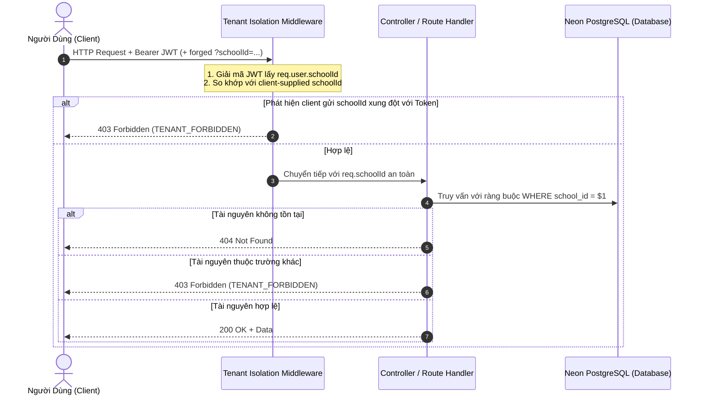

# Kiến Trúc Cô Lập Đa Trường (Multi-School Tenant Isolation Architecture)

Tài liệu này quy định kiến trúc bảo mật và nguyên tắc cô lập dữ liệu trường học (Multi-tenant isolation) cho nền tảng **EduPortal**.

---

## 1. Mục Tiêu & Nguyên Tắc Cốt Lõi

1. **Zero Trust Tenancy**: Người dùng thuộc trường nào chỉ được phép đọc và ghi dữ liệu thuộc trường đó.
2. **Identity-Derived School Context**: Thuộc tính trường học (`schoolId`) được trích xuất trực tiếp từ JWT Token đã ký bảo mật của danh tính được xác thực, tuyệt đối **không bao giờ tin tưởng** tham số `schoolId` hoặc `school_id` do client truyền lên qua Query Parameter, URL Path hoặc Request Body.
3. **Phòng Chống Leo Quyền (Privilege Escalation Prevention)**: Mọi nỗ lực của người dùng thông thường gửi kèm `schoolId` khác với trường học được cấp quyền trong token sẽ bị từ chối ngay lập tức với mã lỗi `403 Forbidden` (`TENANT_FORBIDDEN`).
4. **Super-Admin Exception**: Ngoại lệ vượt phạm vi trường duy nhất chỉ dành cho vai trò quản trị hệ thống tối cao (`super_admin`).
5. **Safe 403 / 404 Behavior**:
   - Nếu tài nguyên không tồn tại trên hệ thống $\rightarrow$ Trả về `404 Not Found`.
   - Nếu tài nguyên tồn tại nhưng thuộc trường khác hoặc ngoài phạm vi quyền hạn $\rightarrow$ Trả về `403 Forbidden` với mã lỗi chuẩn `TENANT_FORBIDDEN` hoặc `FORBIDDEN`.
   - Tuyệt đối không để rò rỉ stack trace, thông tin schema nội bộ hoặc dữ liệu nhạy cảm.

---

## 2. Mô Hình Luồng Dữ Liệu & Kiểm Soát Server-Side



---

## 3. Các Lớp Bảo Mật Được Áp Dụng

### 3.1. Tầng Token & Xác Thực Danh Tính (`server/modules/auth/auth.service.js`)
- Mọi token JWT phát hành qua hàm `login` đều chứa trường `schoolId`:
  ```javascript
  const token = signToken({
    id: user.id,
    role: user.role,
    email: user.email,
    schoolId: user.school_id || 'sch_bacau',
  });
  ```
- Khi quản trị viên tạo người dùng mới (`POST /api/auth/register`), hệ thống ép buộc `school_id` của tài khoản mới phải là trường của quản trị viên khởi tạo (`req.user.schoolId`).

### 3.2. Tầng Middleware Ngăn Chặn Leo Quyền (`server/shared/auth/tenant.middleware.js`)
- Middleware `validateTenantPrivilegeEscalation` kiểm tra các tham số `req.query.schoolId`, `req.body.schoolId`, `req.params.schoolId`.
- Nếu phát hiện giá trị khác với `req.user.schoolId` và tài khoản không có quyền `super_admin`: lập tức trả về `403 Forbidden` (`TENANT_FORBIDDEN`).
- Ghi đè tham số trong `req.body` để ngăn chặn parameter pollution.

### 3.3. Tầng Phân Hệ Giáo Viên (`server/routes/teacher.js`)
- `GET /api/teacher/classes`: Chỉ liệt kê các lớp học có `school_id = req.schoolId`. Nếu giáo viên yêu cầu xem danh sách học sinh của một `classId` thuộc trường khác $\rightarrow$ Trả về `403 Forbidden`.
- `GET /api/teacher/analytics`: Kiểm tra quyền sở hữu lớp học trước khi xuất báo cáo phân tích học tập.

### 3.4. Tầng Phân Hệ Quản Trị Viên (`server/routes/admin.js`)
- Quản trị viên Trường A không thể xem, sửa đổi hoặc xóa tài khoản học sinh/giáo viên của Trường B:
  - `PUT /api/admin/users/:id` $\rightarrow$ Trả về `403 Forbidden` nếu user thuộc trường khác.
  - `DELETE /api/admin/users/:id` $\rightarrow$ Trả về `403 Forbidden` nếu user thuộc trường khác.
- Quản trị viên Trường A không thể chỉnh sửa hoặc xóa lớp học của Trường B:
  - `PUT /api/admin/classes/:id` $\rightarrow$ Trả về `403 Forbidden` nếu lớp thuộc trường khác.
  - `DELETE /api/admin/classes/:id` $\rightarrow$ Trả về `403 Forbidden` nếu lớp thuộc trường khác.

### 3.5. Tầng Phân Hệ Phụ Huynh (`server/routes/parent.js`)
- `GET /api/parent/children`: Chỉ trả về danh sách con cái trực thuộc tài khoản phụ huynh và cùng trường.
- `GET /api/parent/children/:id`:
  - Trả về `404 Not Found` nếu ID học sinh không tồn tại.
  - Trả về `403 Forbidden` (`TENANT_FORBIDDEN`) nếu học sinh thuộc trường khác.
  - Trả về `403 Forbidden` (`FORBIDDEN`) nếu học sinh thuộc cùng trường nhưng không phải con của phụ huynh này.
- `POST /api/parent/leave-requests`: Ngăn chặn nộp đơn nghỉ phép cho học sinh lạ hoặc học sinh trường khác.

### 3.6. Tầng Phân Hệ Học Sinh (`server/routes/student.js`)
- `GET /api/student/submissions/:id`:
  - Trả về `404 Not Found` nếu ID bài nộp không tồn tại.
  - Trả về `403 Forbidden` (`TENANT_FORBIDDEN`) nếu bài nộp thuộc học sinh của trường khác.
  - Trả về `403 Forbidden` (`FORBIDDEN`) nếu bài nộp thuộc học sinh khác trong cùng trường.
- `GET /api/student/assignments/:id`: Không cho phép học sinh xem đề thi của trường khác.

---

## 4. Ràng Buộc CSDL Đa Trường (Tenant-Aware Unique Constraints)

Để hỗ trợ nhiều trường học có cùng tên lớp (ví dụ: cả Trường THPT Bắc Âu và Trường THPT Hoa Sen đều có lớp "10A1"), Migration `0004` đã thiết lập unique index có phạm vi trường học:

```sql
CREATE UNIQUE INDEX IF NOT EXISTS uq_classes_school_name ON classes(school_id, name);
```

Điều này bảo đảm:
- Trường A không thể tạo 2 lớp cùng tên "10A1".
- Nhưng Trường A và Trường B hoàn toàn có thể cùng có lớp "10A1" mà không bị xung đột khóa trùng lặp.
